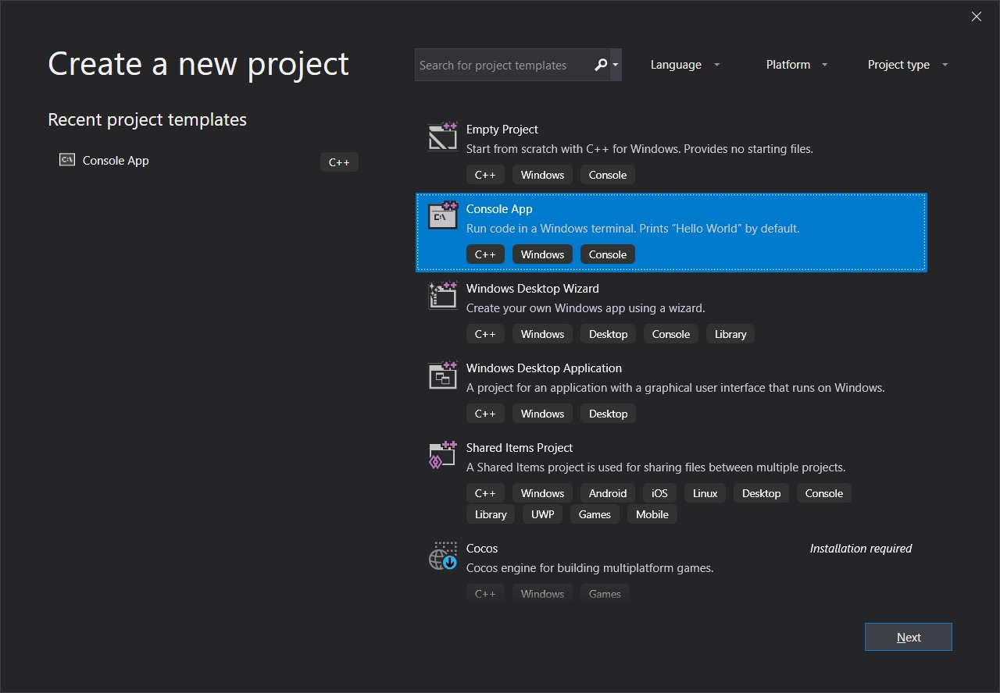
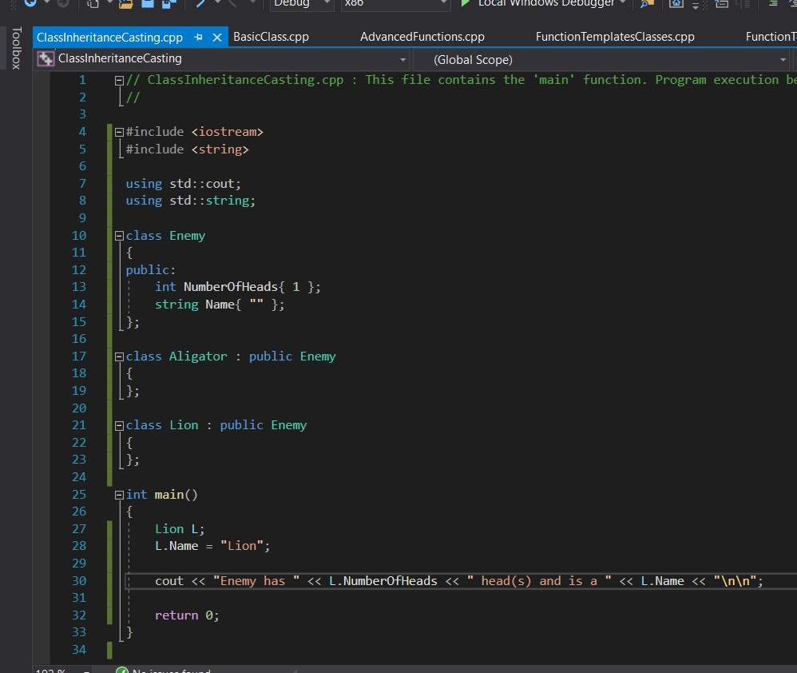
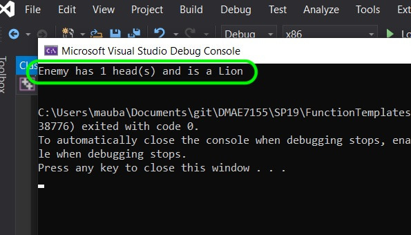
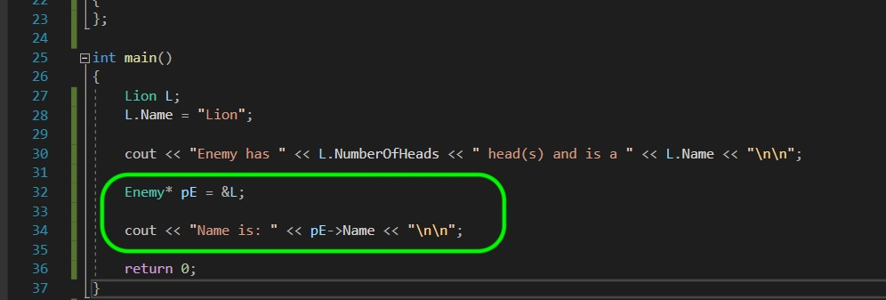
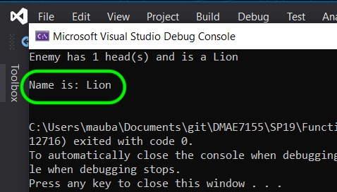
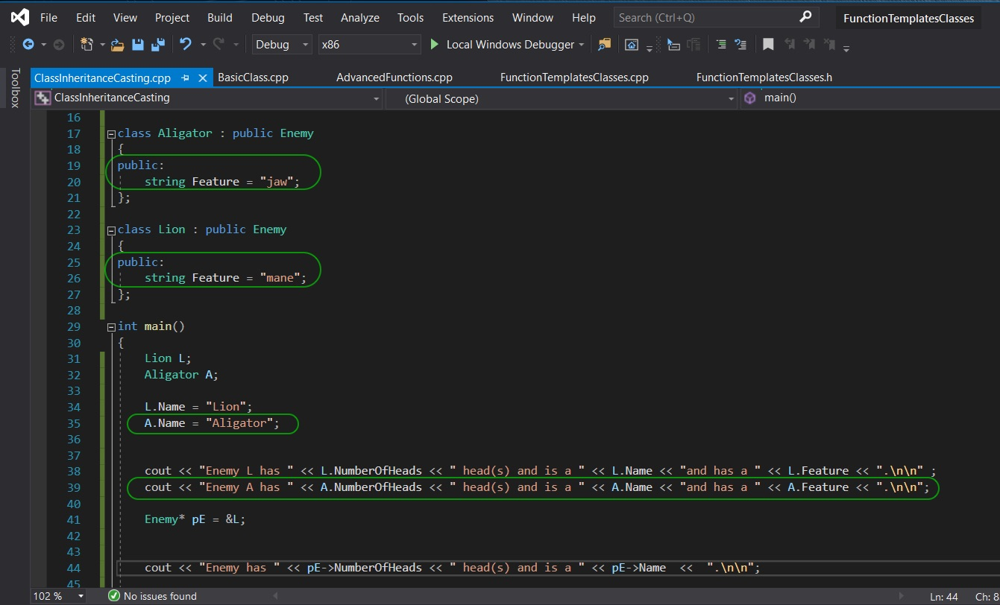
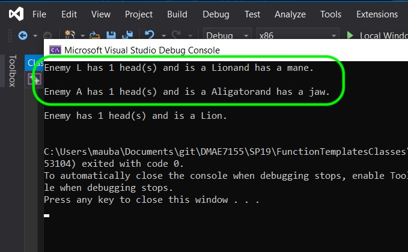
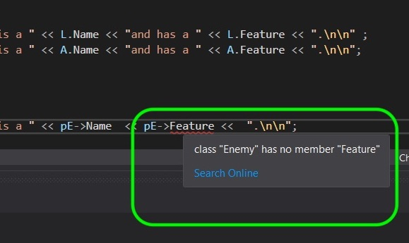

### Class Inheritance

[previous](../) • [home](../README.md#user-content-gms2-top-down-shooter) • [next](../)

Now classes are rarely used as just a plain class.  We normally create different types and inherit from other classes.  Lets look at enemies in a game.  What if we have 10 enemy types in the game.  They might all share some of the same features that they all have in common.  We can create an `Enemy` class with all the common elements.  Then we can create a specific enemy such as a `Bear` that inherits from the enemy class.  We can give it its unique parts that make up a bear that might be unique like claws, a head etc.  We might even have an intermediate class of `Mammals` or `Quadripeds` that again can define an enemy -> mammal -> bear.  This can allow us to check in the game for collisions with the enemy class, then downcast and find out what type of enemy it is.

 

---

##### `Step 1.`\|`SPCRK`|:small_blue_diamond:

Open up the **FunctionTemplateClasses** solution you have been working on.  Lets add a new project by right clicking on the solution file and select **Add \| New Project...**.  Select a **Console App** template and call this new project `ClassInheritanceCasting`. Right click on this new project and select **Set as StartUp Project**.

##### `Step 2.`\|`FHIU`|:small_blue_diamond: :small_blue_diamond: 

We have here a very simple example.  We have a parent class called `Enemy`.  All our enemies have one head, so we set this variable here.  There is no name for this enemy as it is meant to be derived, so the name of the monster is left blank. We have an `Aligator` and `Lion` derived class from `Enemy`.  In main we show that you can access members from both the derived (child class) and the parent class.

##### `Step 3.`\|`SPCRK`|:small_blue_diamond: :small_blue_diamond: :small_blue_diamond:

Now compile and run and you can see that both members are accessible.

##### `Step 4.`\|`SPCRK`|:small_blue_diamond: :small_blue_diamond: :small_blue_diamond: :small_blue_diamond:

##### `Step 5.`\|`SPCRK`| :small_orange_diamond:

We cast up to the base class from the derived class.  We need to use pointers to do this.  So we can cast from the derived class `Lion` to a pointer to the class it is derived from `Enemy`.  This is an implicit cast.  We can just point to one of its parent classes.

##### `Step 6.`\|`SPCRK`| :small_orange_diamond: :small_blue_diamond:

Lets run and see what it prints for the name? Even though we set the **Name** member inside the derived class it was declared in the base class so this i

##### `Step 7.`\|`SPCRK`| :small_orange_diamond: :small_blue_diamond: :small_blue_diamond:

Lets add a public member to the derived classes and print both an **Aligator** and **Lion** class.

##### `Step 8.`\|`SPCRK`| :small_orange_diamond: :small_blue_diamond: :small_blue_diamond: :small_blue_diamond:

Now run it and you can see that we can access this new member in the derived class.

##### `Step 9.`\|`SPCRK`| :small_orange_diamond: :small_blue_diamond: :small_blue_diamond: :small_blue_diamond: :small_blue_diamond:

Now run it and you can see that we can access this new member in the derived class.

##### `Step 10.`\|`SPCRK`| :large_blue_diamond:

Now run in the pointer to the base class you are not able to access the derived **Feature** member.  This is stored in the derived class only.  This is enough for all and we will explore class construction more later on.

___

| [previous](../)| [home](../README.md#user-content-gms2-top-down-shooter) | [next](../)|
|---|---|---|
