### Classes II

[previous](../) • [home](../README.md#user-content-gms2-top-down-shooter) • [next](../)

Classes continued...

 

---

##### `Step 1.`\|`SPCRK`|:small_blue_diamond:

Run the game and you should see the **King of Hearts** as the instantiated card. 

##### `Step 2.`\|`FHIU`|:small_blue_diamond: :small_blue_diamond: 

Now we should also consider the programmer that doesn't know about what parameters to pass.  What about setting the default card to **Ace of Hearts** if the player passes no parameters to the class?

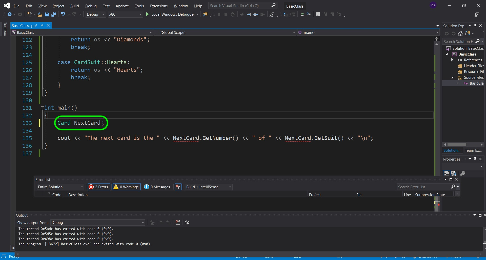

##### `Step 3.`\|`SPCRK`|:small_blue_diamond: :small_blue_diamond: :small_blue_diamond:

In the class add another constructor with no parameters being passed.

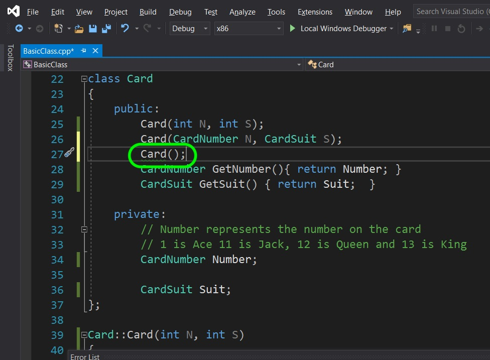

##### `Step 4.`\|`SPCRK`|:small_blue_diamond: :small_blue_diamond: :small_blue_diamond: :small_blue_diamond:

Define this function by overriding the card constructor with an Ace of Hearts.

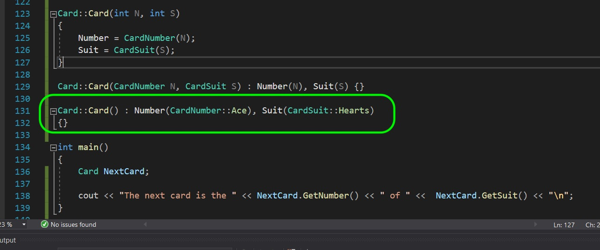

##### `Step 5.`\|`SPCRK`| :small_orange_diamond:

Run and compile the game and we now have a default card. Next up we will refactor a little bit.

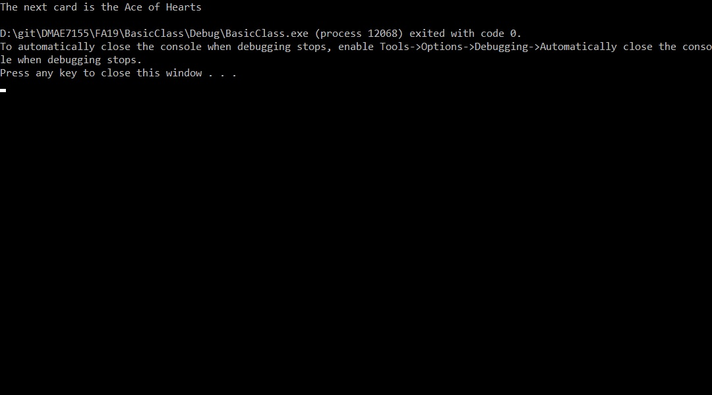

##### `Step 6.`\|`SPCRK`| :small_orange_diamond: :small_blue_diamond:

Now I think it might be useful to keep a string with the card number and suit. We can make it a string, then we don't need to override the OS operator.

Open up **BaseClass.cpp** and add two private string variables for the card name and suit then two private void functions to set the name. We do not want the user to call it, but instead the constructor should call it so we have a card suit and number string when we need to use the object.

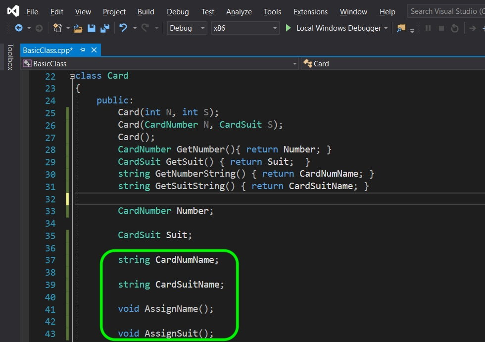

##### `Step 7.`\|`SPCRK`| :small_orange_diamond: :small_blue_diamond: :small_blue_diamond:

Create two public getters to get the names of the variable.  We can do this inline as it is a simple return.  Notice that the user of this class can't set the name or number, but can only read it.

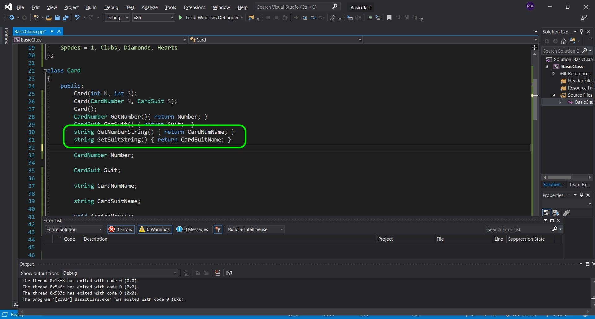

##### `Step 8.`\|`SPCRK`| :small_orange_diamond: :small_blue_diamond: :small_blue_diamond: :small_blue_diamond:

OK, lets define our `AssignName()` function.  We will just add a `switch` statement and put the different name of card numbers.

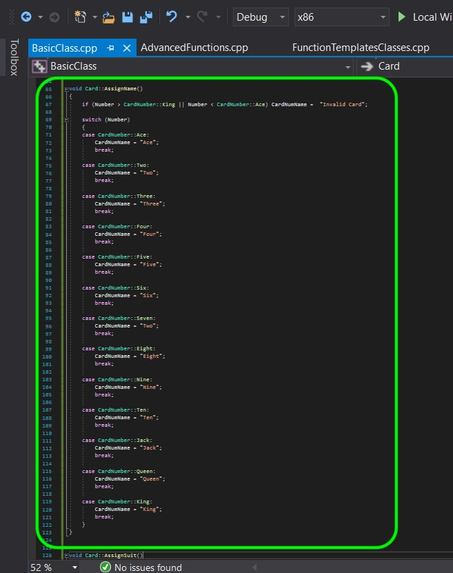

##### `Step 9.`\|`SPCRK`| :small_orange_diamond: :small_blue_diamond: :small_blue_diamond: :small_blue_diamond: :small_blue_diamond:

Do the same thing in the `AssignSuit` definition:

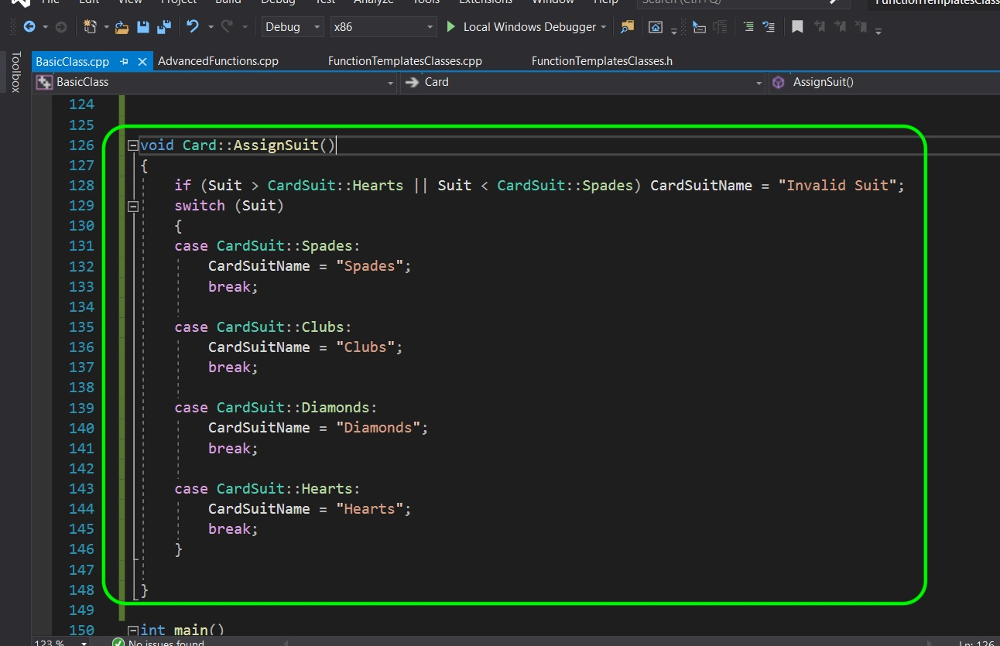

##### `Step 10.`\|`SPCRK`| :large_blue_diamond:

Delete the `os << ` overrides.  You don't need these anymore as **string** type is already supported. Change the call in `cout` to `GetNumnberString()` and `GetSuitString`.  Then create a new `NextCard` with the 4th number and 3rd suit.

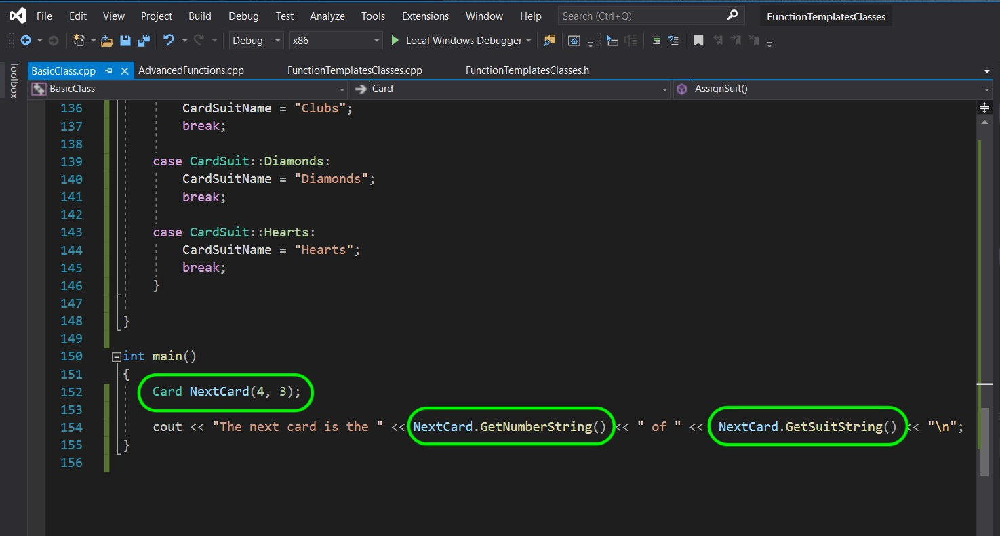

##### `Step 11.`\|`SPCRK`| :large_blue_diamond: :small_blue_diamond: 

Run the game and you should see a **4 of Diamonds**.

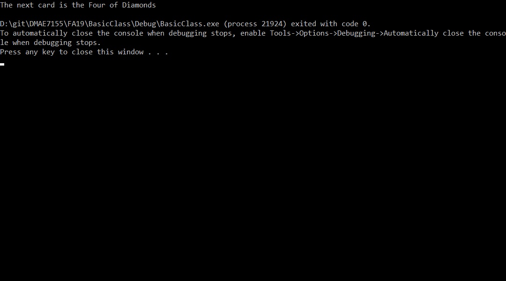

##### `Step 12.`\|`SPCRK`| :large_blue_diamond: :small_blue_diamond: :small_blue_diamond: 

Lets add an overload operator for ++ as a prefix and postfix operator. This will allow the card to go up by one card number.  Also if you go up from King it will go to Ace and wrap again. Lets also add back an overload operator for `os <<` for a **Card** class that will print both the number and suit with a space between it. Now we have an issue.  These overrided classes will need access to private members of this class (++ alters the actual card).  But they are not within the class so can't access private members.  What do we do?  We declare the override as a **[friend](https://en.cppreference.com/w/cpp/language/friend)** declaration.  This declaration gives this class access to your private members.

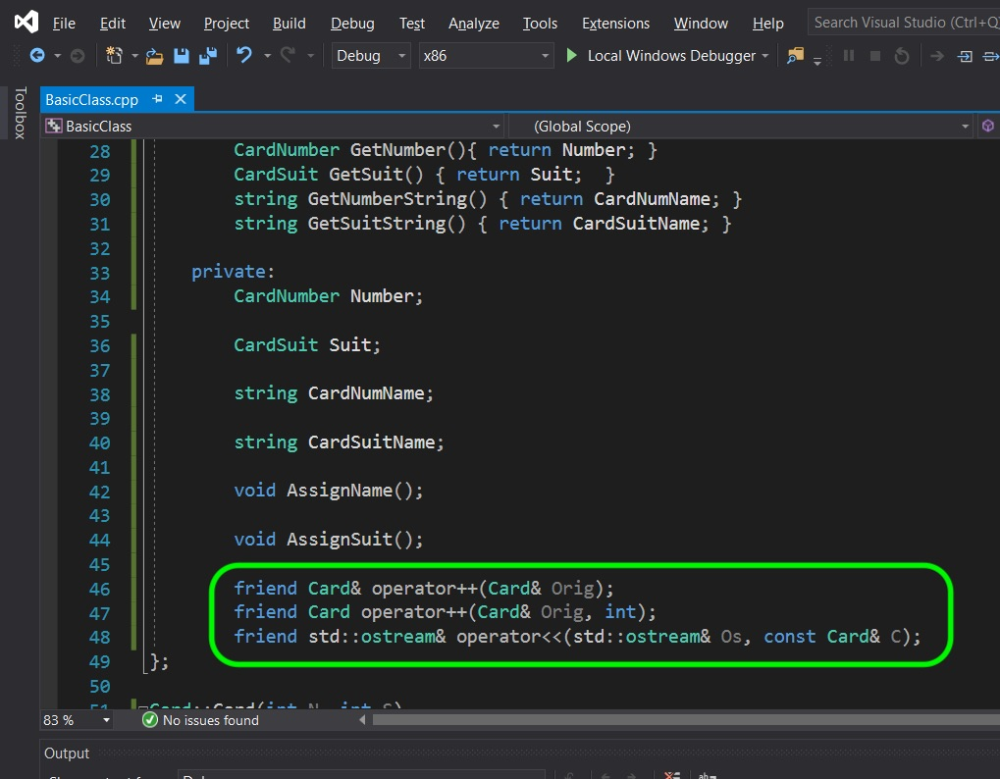

##### `Step 13.`\|`SPCRK`| :large_blue_diamond: :small_blue_diamond: :small_blue_diamond:  :small_blue_diamond: 

Lets define the prefix and postfix `++` operator.  Remember that if it is a postfix it calls the prefix operator that wraps the ++ back to Ace from King or just advances to the next card.  A **static_cast** does an implicit conversion when casting from one type to another. It basically tells the compiler to cast the conversion between int and enum, then enum and class at compile time. It is more restrictie than a c style cast and will give errors when dangerous casts are made.

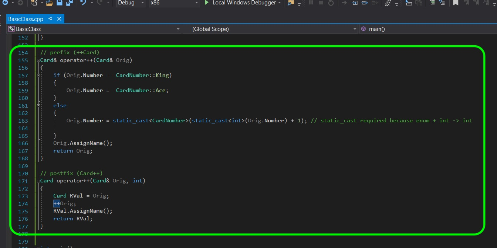

##### `Step 14.`\|`SPCRK`| :large_blue_diamond: :small_blue_diamond: :small_blue_diamond: :small_blue_diamond:  :small_blue_diamond: 

Now add a definition for the `os <<` operator for the **Card** class.  We will include the name and suit with a space between them.

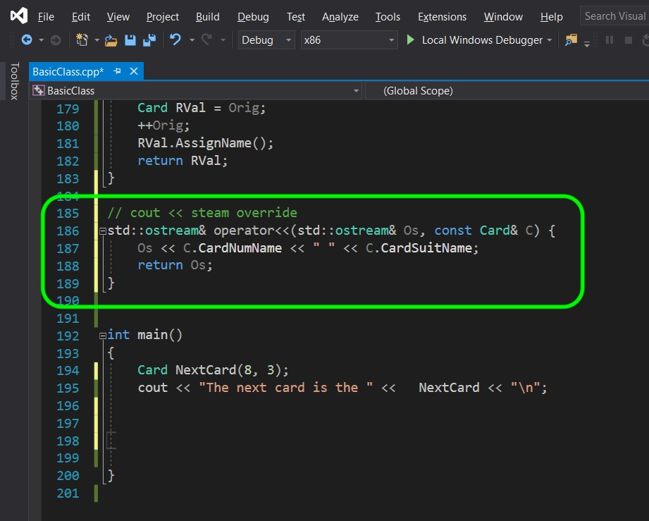

##### `Step 15.`\|`SPCRK`| :large_blue_diamond: :small_orange_diamond: 

Now lets test the postfix operator.  So this should take place after the `cout` so there should be a difference of two cards between the two outputs.

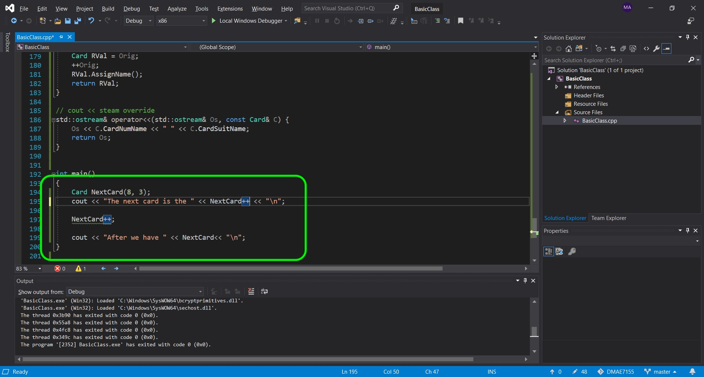

##### `Step 16.`\|`SPCRK`| :large_blue_diamond: :small_orange_diamond:   :small_blue_diamond: 

Run the game and test it.  Notice that the operator doen't increase until after the line it is run in which is correct.

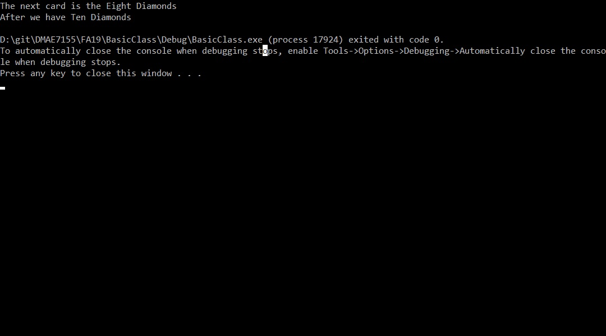

##### `Step 17.`\|`SPCRK`| :large_blue_diamond: :small_orange_diamond: :small_blue_diamond: :small_blue_diamond:

Now test the prefix operator where the card should be increased BEFORE it is output:

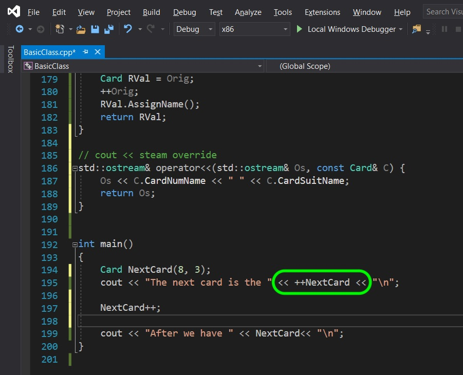

##### `Step 18.`\|`SPCRK`| :large_blue_diamond: :small_orange_diamond: :small_blue_diamond: :small_blue_diamond: :small_blue_diamond:

Compile and run and notice that it updates before it hits the stream, so we have the operator overloads working properly.

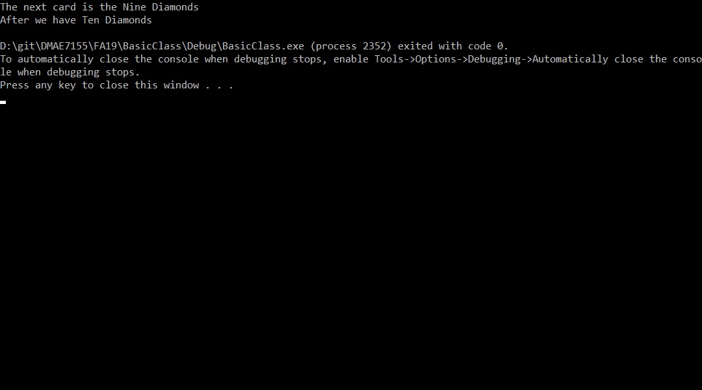

___

| [previous](../)| [home](../README.md#user-content-gms2-top-down-shooter) | [next](../)|
|---|---|---|
