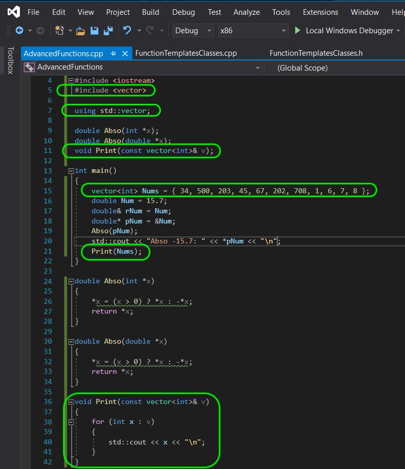
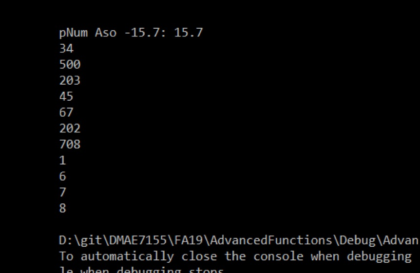
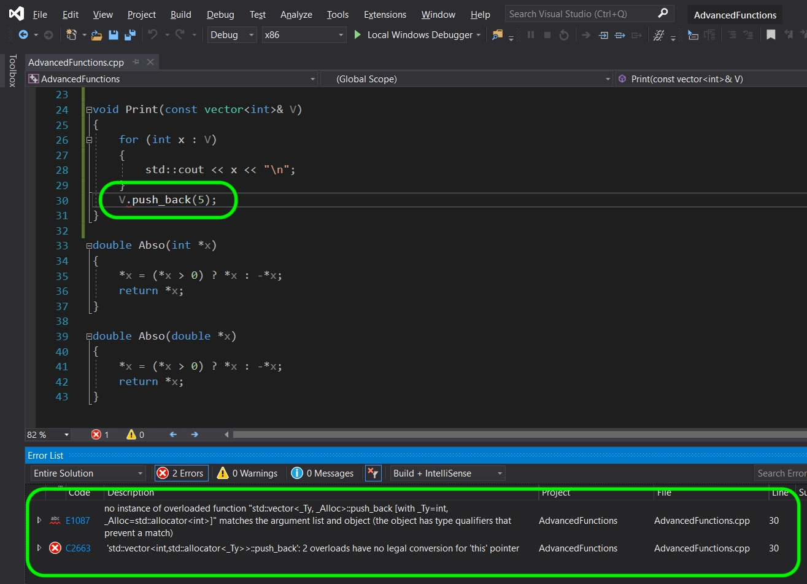
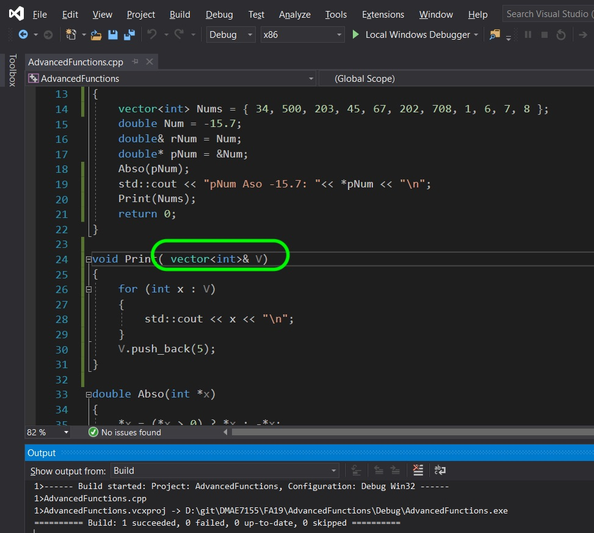
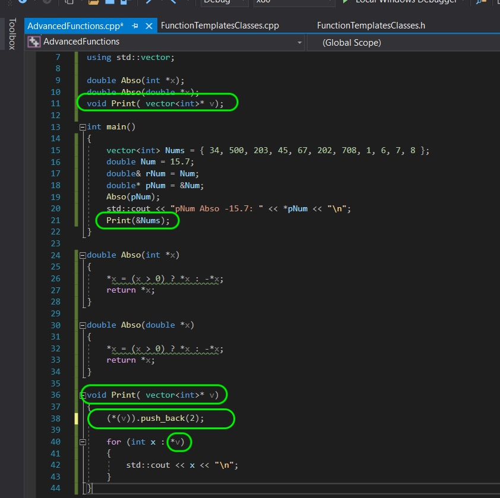
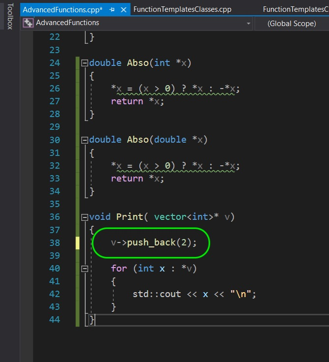
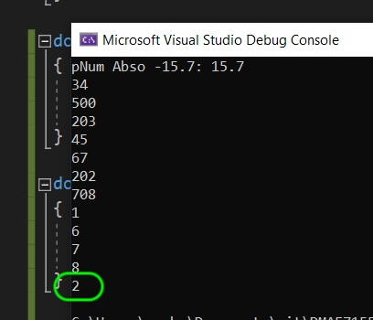
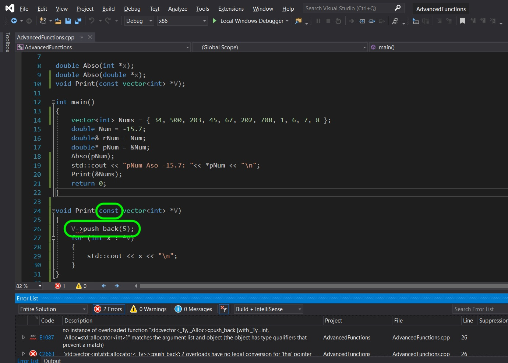
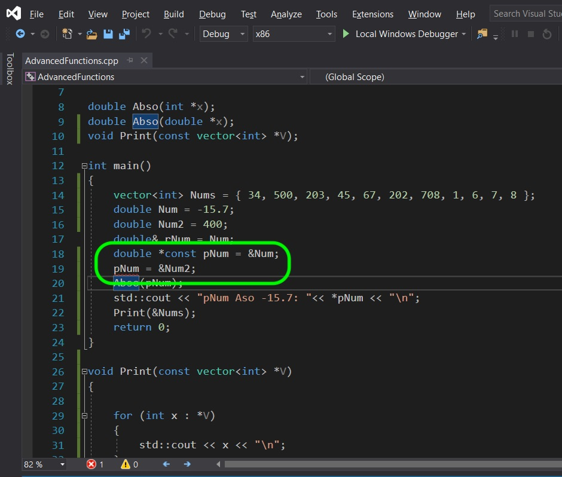

### Const Reference and Pointer

[previous](../) • [home](../README.md#user-content-gms2-top-down-shooter) • [next](../)

## Const Vector and Pointer
Now what if I want to pass a large file and not have it changed by the function I am passing the value to.  How do I do this with using pass by refeerence and pass by pointer?  This is where `const` comes in handy.  We can define a parameter as `const` so that the function we are passing it to can't change the value.

 

---

##### `Step 1.`\|`SPCRK`|:small_blue_diamond:

If you start your reference or pointer parameter with `const` the original variable that it is referencing or pointing to can not be changed.  Add `const` to the parameters and lets create a new function called `Print()` to test this out on.

##### `Step 2.`\|`FHIU`|:small_blue_diamond: :small_blue_diamond: 

Compile and run the application and you see that it prints out the vector from by passing by **const reference**.

##### `Step 3.`\|`SPCRK`|:small_blue_diamond: :small_blue_diamond: :small_blue_diamond:

Now lets test whether `const` works.  Try to add an element at the end of the array and press compile iside the `Print()` function.  Try it and see the compile error:

##### `Step 4.`\|`SPCRK`|:small_blue_diamond: :small_blue_diamond: :small_blue_diamond: :small_blue_diamond:

Remove `const` from the `Print()` function and it now compiles and allows you to change the vector passes by reference.

##### `Step 5.`\|`SPCRK`| :small_orange_diamond:

We can do exactly the same thing with pointers.  Change the `Print()` to pass by pointer.  You will need to pass it the address of the vector (the name with the address `&` symbol before).  You will also need to dereference the pointer in the for loop.  Lets start by not setting it as `const`. Now to dereference the pointer and select `push_back` is pretty complex looking.  We need to dereference the pointer to dot instance into the function.

##### `Step 6.`\|`SPCRK`| :small_orange_diamond: :small_blue_diamond:

There is an easier shortcut to represent exactly the same thing.  To dererence a pointer and access its members can be done simply by instead using `->`.  Now change it to:

##### `Step 7.`\|`SPCRK`| :small_orange_diamond: :small_blue_diamond: :small_blue_diamond:

Run the project and you should now see a `2` added to the end of the TArray.

##### `Step 8.`\|`SPCRK`| :small_orange_diamond: :small_blue_diamond: :small_blue_diamond: :small_blue_diamond:

Now change the pointers to `const` and it will no longer compile.

##### `Step 9.`\|`SPCRK`| :small_orange_diamond: :small_blue_diamond: :small_blue_diamond: :small_blue_diamond: :small_blue_diamond:

Pointers are tricky as you can also put the `const` after the pointer.  This means that you still can alter the value it is pointing to, but you can't change the memory address that the pointer is pointing to.  Line 19 would be legal and valid if you didn't have `const` after the pointer.  Be aware and pay attention on where the pointer is located. Next up we will look at classes.

___

| [previous](../)| [home](../README.md#user-content-gms2-top-down-shooter) | [next](../)|
|---|---|---|
