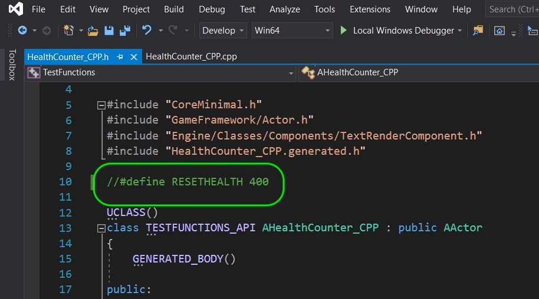
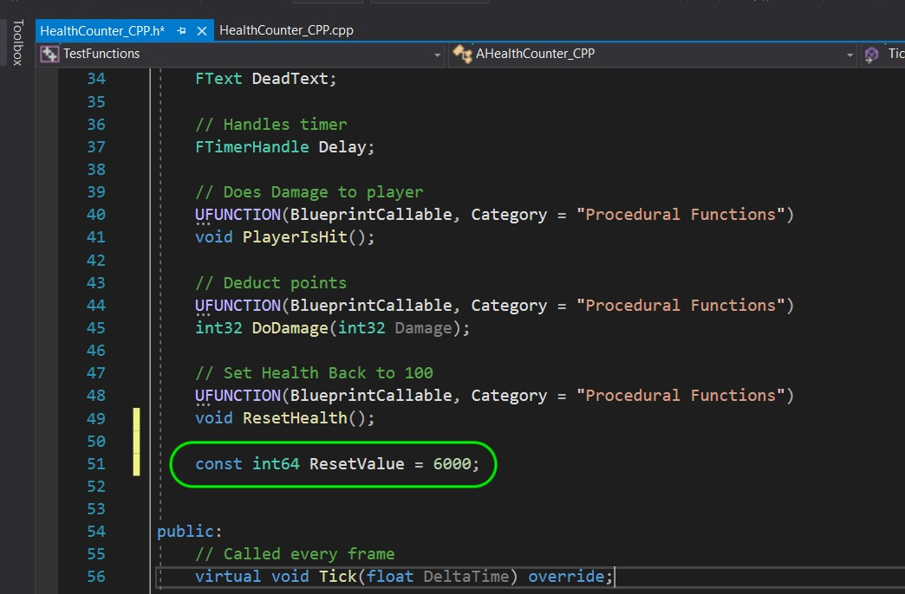
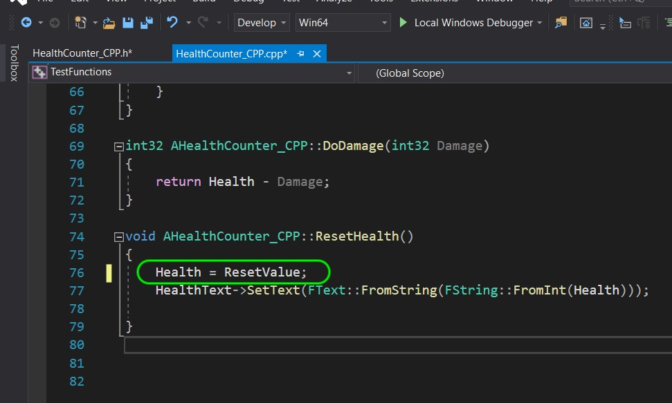
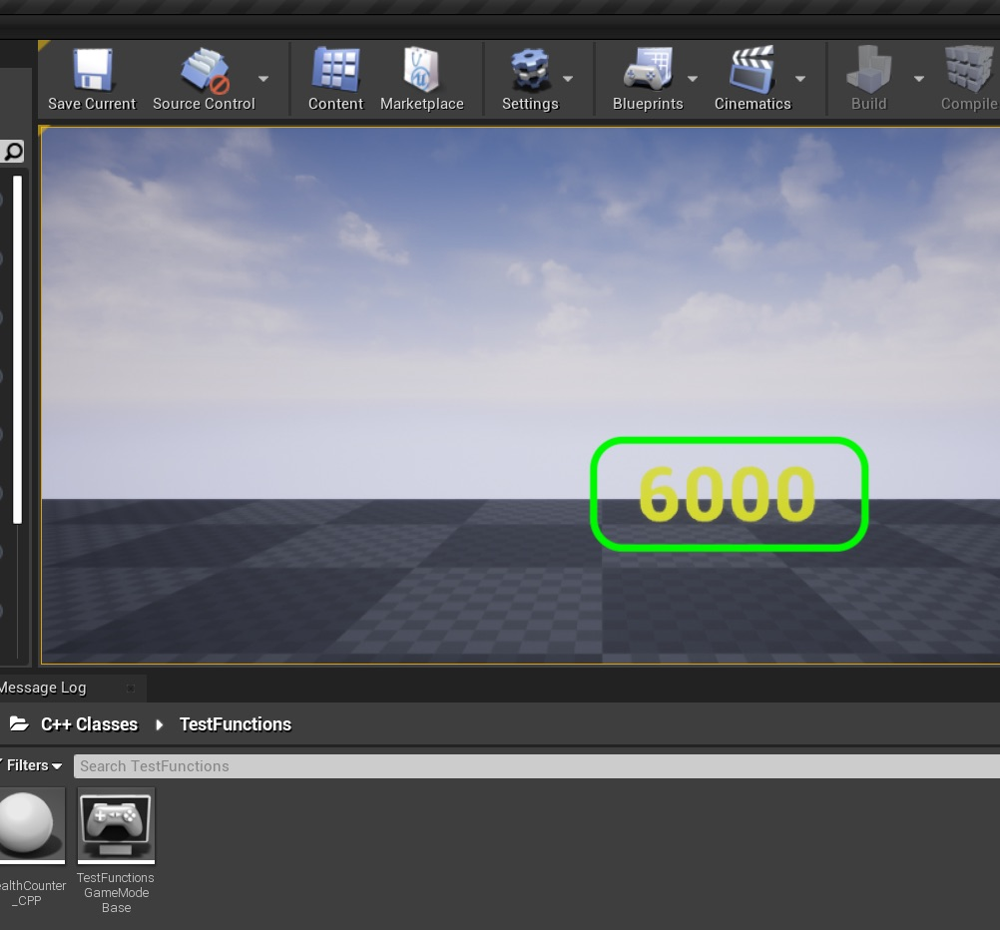
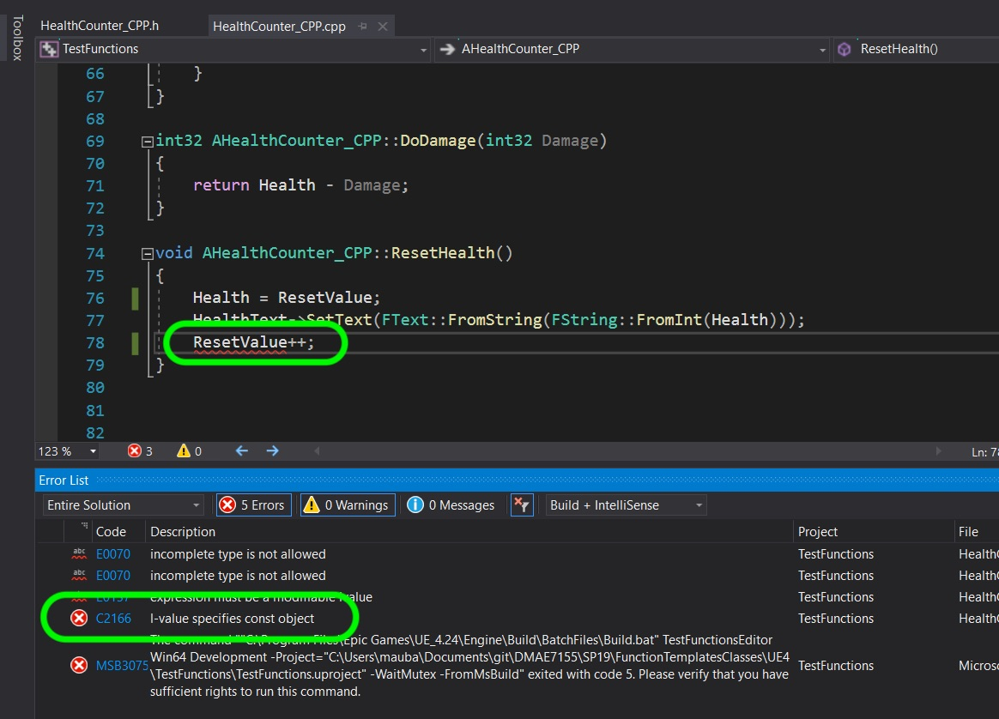

### Const

[previous](../) • [home](../README.md#user-content-gms2-top-down-shooter) • [next](../)

Const in C++ cannot be altered by the program and the compiler will give an error if this variable is changed.

Lets open up our previous UE4 project TestFunctions.sh in Visual Studio.

 

---

##### `Step 1.`\|`SPCRK`|:small_blue_diamond:

A better solution for the Macro we used for than a Macro for a const which IS scope controlled. So open up our Unreal project again and lets make a small change. Comment out the macro:

##### `Step 2.`\|`FHIU`|:small_blue_diamond: :small_blue_diamond: 

Create a new variable called `ResetValue` and initialize it to `6000`. Add a `const` keyword that tells the compiler that this value is a constant and cannot be changed.

##### `Step 3.`\|`SPCRK`|:small_blue_diamond: :small_blue_diamond: :small_blue_diamond:

Now open the `.cpp` and change the definition of **ResetHealth** and set **Health** to the new constant **Reset Value**.

##### `Step 4.`\|`SPCRK`|:small_blue_diamond: :small_blue_diamond: :small_blue_diamond: :small_blue_diamond:

Compile and run the game and you see that it resets the score to **6000** now when the countdown ends.

##### `Step 5.`\|`SPCRK`| :small_orange_diamond:

Now if you try and change the const variable the compiler will exit with an error.

| [previous](../)| [home](../README.md#user-content-gms2-top-down-shooter) | [next](../)|
|---|---|---|
