### Containers

[previous](../) • [home](../README.md#user-content-gms2-top-down-shooter) • [next](../)

A container is a holder object that contains a collection of objects like an array does but with greater functionality and safety. There is a performance hit for using a container, but for a lot of applications it is safer to use. In C++ the most common are available in the Standard Template Library or STL. Lets open up the previous C++ solution FunctionTemplateClasses.

 

---

##### `Step 1.`\|`SPCRK`|:small_blue_diamond:

 Include in a `` header file and to save typing include a using `std::vector` and `std::string`.

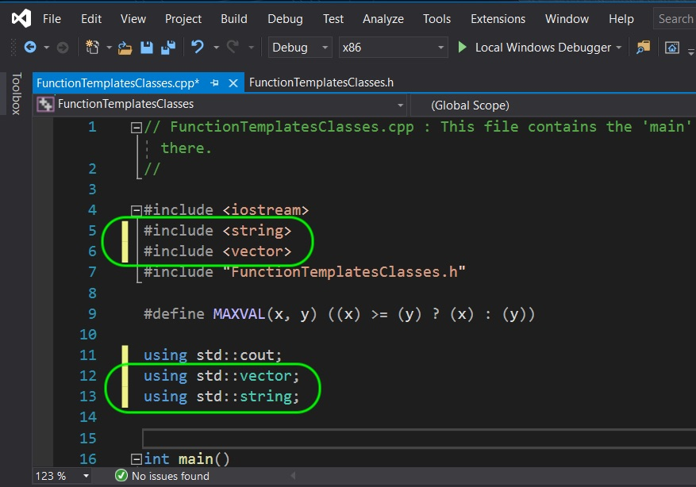

##### `Step 2.`\|`FHIU`|:small_blue_diamond: :small_blue_diamond: 

You can initialize this container in a similar way to an array. You can call a `vector`, then pass in angle brackets it type, in our case ``, name the structure and pass it the number of elements that we are including.

These 4 strings in this container need to be asigned (they default to an empty string). We assign them the same way we do a regular static array. Remember for an container size of `4` we access them with `0` through `3` like so:

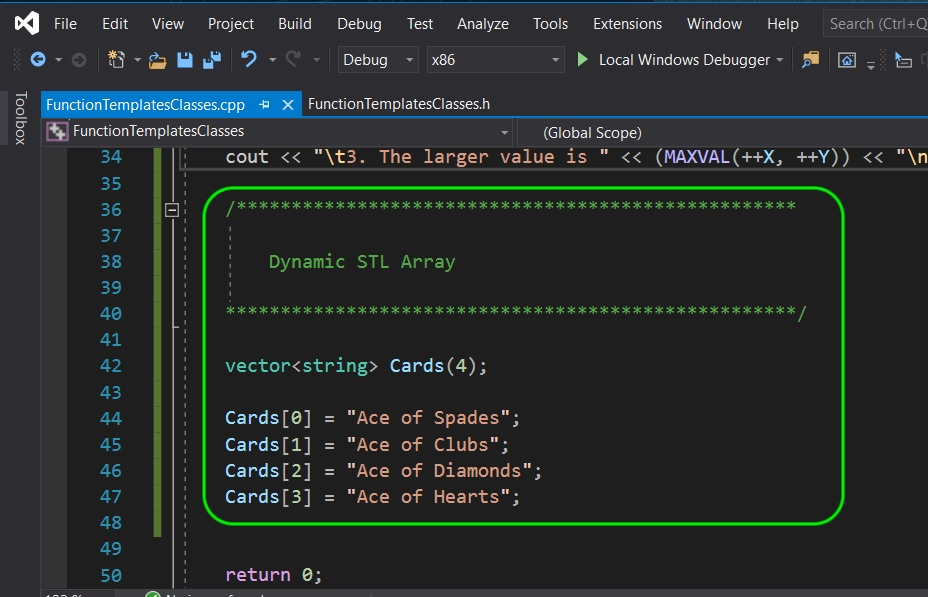

##### `Step 3.`\|`SPCRK`|:small_blue_diamond: :small_blue_diamond: :small_blue_diamond:

Another way of assigning this container is with assigning a list of the type between brackets `{}` separated with commas. So this is the same as the previous way of doing it. Comment out the first set of assignments and add the following:

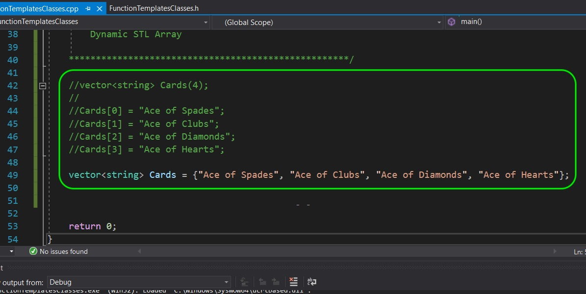

##### `Step 4.`\|`SPCRK`|:small_blue_diamond: :small_blue_diamond: :small_blue_diamond: :small_blue_diamond:

So we will send the first card and print it out in the output stream. We do it in the same we we do with an array.

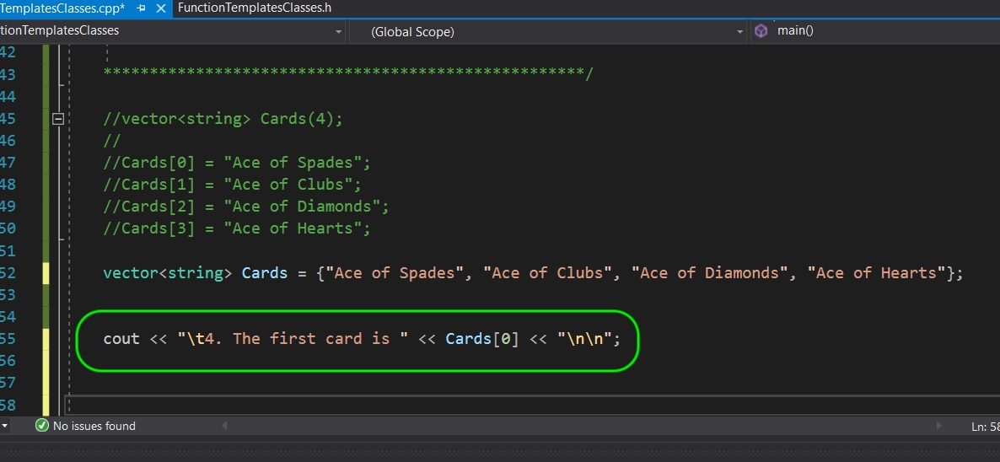

##### `Step 5.`\|`SPCRK`| :small_orange_diamond:

We should see our first card being the Ace of Spades when we compile and run it!

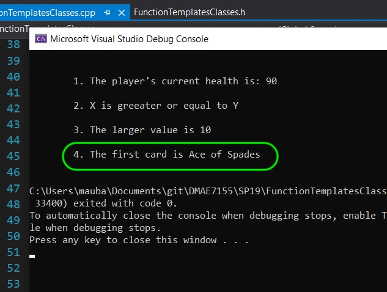

##### `Step 6.`\|`SPCRK`| :small_orange_diamond: :small_blue_diamond:

Now lets try and access a non-existant index in this container. I am looking for the 50th entry:

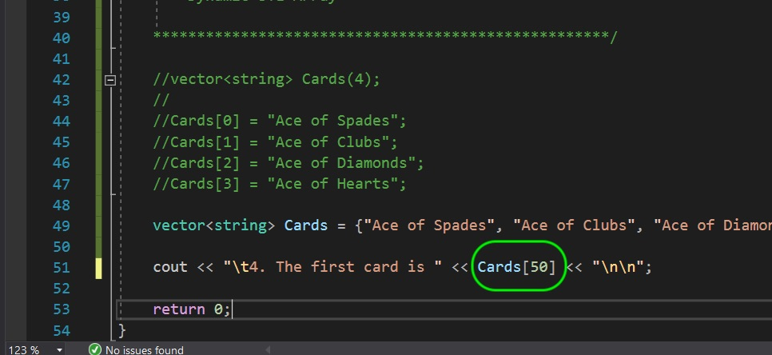

##### `Step 7.`\|`SPCRK`| :small_orange_diamond: :small_blue_diamond: :small_blue_diamond:

We get an assertion and the program stops to run. In my case it says the **vector subscript out of range**. The program can't point to this memory as this does not contain anything at this moment. You can press abort and we will continue.

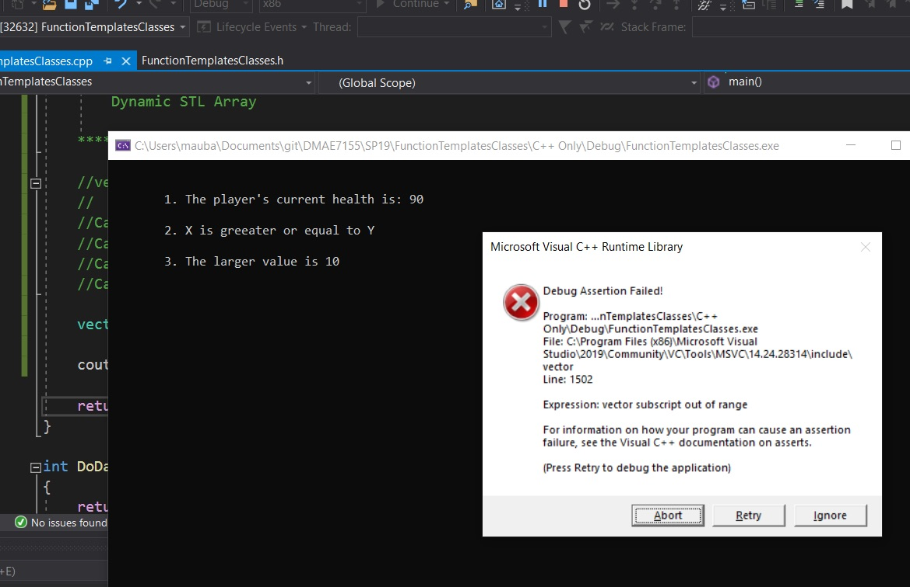

##### `Step 8.`\|`SPCRK`| :small_orange_diamond: :small_blue_diamond: :small_blue_diamond: :small_blue_diamond:

 Return the first card array to `0` so it can continue to run without crashing.

The vector is a template class so it comes with many functions that an array doesn't that can help us. One is a function called `size()`. This returns the number of elements inside the vector. We access the function by `.` referencing it from the class (we will get into this some more shortly). So `Card.size()` will return the number of cards in this vector as an integer.

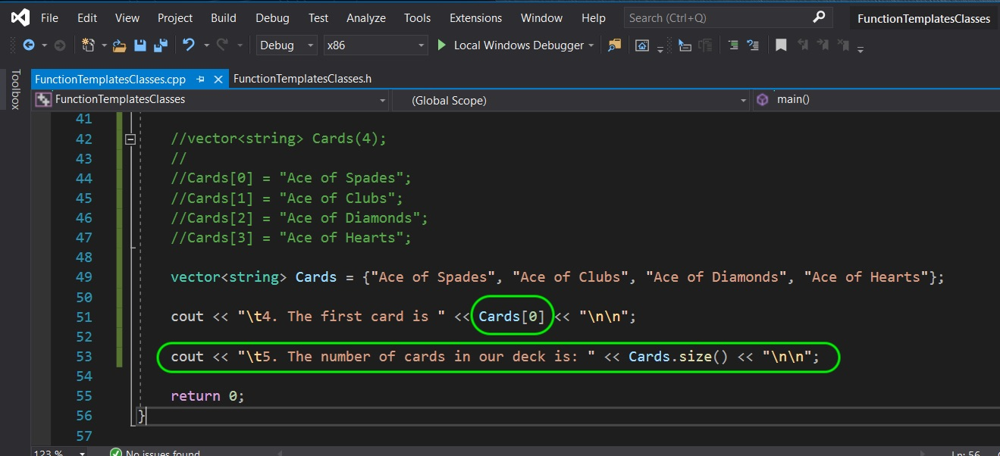

##### `Step 9.`\|`SPCRK`| :small_orange_diamond: :small_blue_diamond: :small_blue_diamond: :small_blue_diamond: :small_blue_diamond:

Run the game and you should now see that the `size()` function returned `4` which we expected.

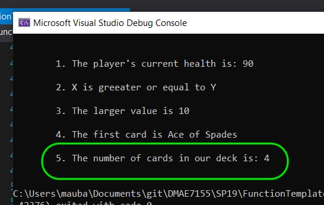

##### `Step 10.`\|`SPCRK`| :large_blue_diamond:

 Lets loop through and print out all 4 cards. We can use the `size()` function to make sure we don't go passed the end of the structure.

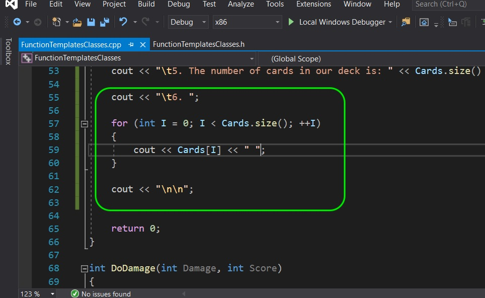

##### `Step 11.`\|`SPCRK`| :large_blue_diamond: :small_blue_diamond: 

Now you will see that it lists the cards in the order you entered them in.

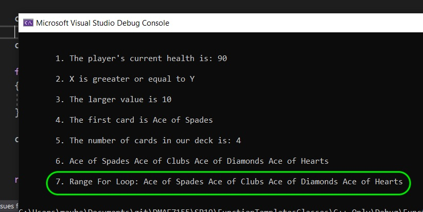

##### `Step 12.`\|`SPCRK`| :large_blue_diamond: :small_blue_diamond: :small_blue_diamond: 

There is an easier way to access all elements in a vector. We can use **range-for-loop**. We access it by getting all individual **strings** in a vector of **\**. We access it with `for (string I: VectorName)`. This goes in order through the vector and places each one in the loop in the variable and type defined before the `:`.

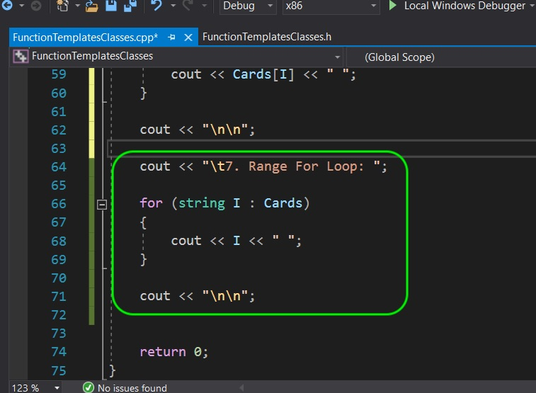

##### `Step 13.`\|`SPCRK`| :large_blue_diamond: :small_blue_diamond: :small_blue_diamond:  :small_blue_diamond: 

Run and compile the program and you get the same result as the for loop.

##### `Step 14.`\|`SPCRK`| :large_blue_diamond: :small_blue_diamond: :small_blue_diamond: :small_blue_diamond:  :small_blue_diamond: 

 Lets shuffle this vector. We need to include another standard function that is included in the `` set of functions. Lets include this in our header file:

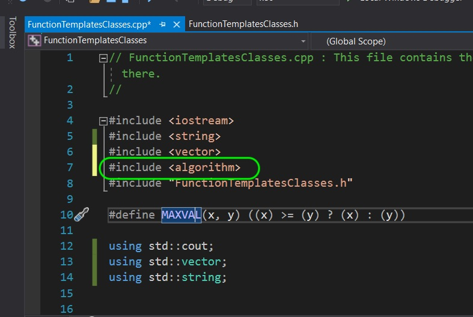

##### `Step 15.`\|`SPCRK`| :large_blue_diamond: :small_orange_diamond: 

Now we will call a template class that is included with algorithm. It is called **[std::random_shuffle](https://en.cppreference.com/w/cpp/algorithm/random_shuffle)**. Since we are not passing it a random number generator it will use `rand()` by default. This template reorders the lements within the given range `(first, last)` with equal probability.

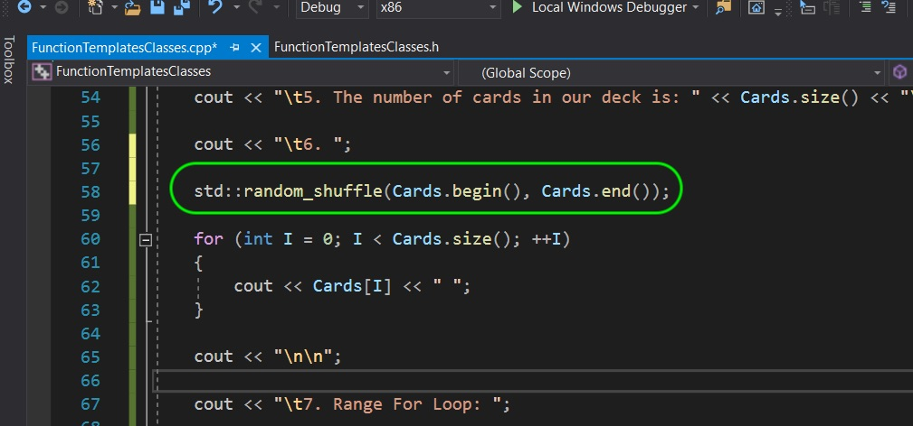

##### `Step 16.`\|`SPCRK`| :large_blue_diamond: :small_orange_diamond:   :small_blue_diamond: 

 Compile and run the program. In my case it swapped hearts and diamonds (it might be different in yours). The key is that if I run it 100 times I will get the same result. Even though I am shuffling it, it will give the same shuffle every time.

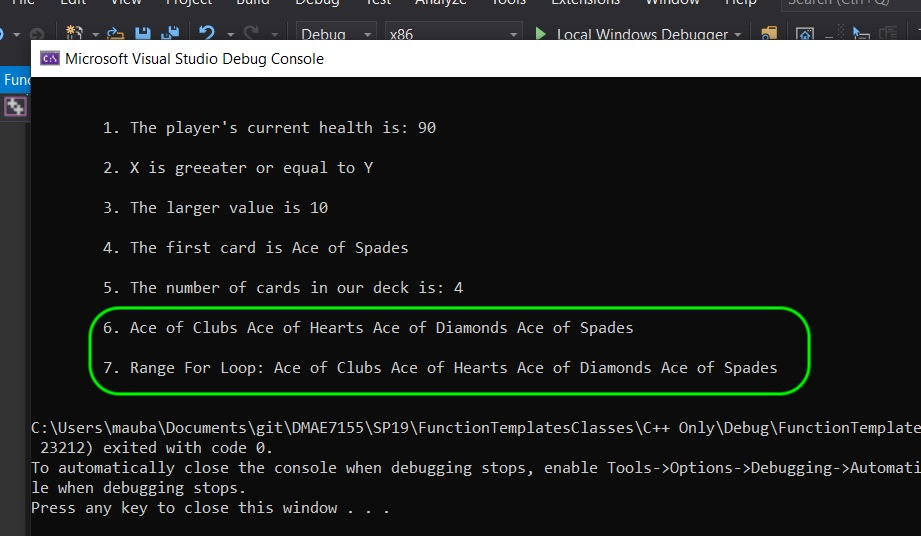

##### `Step 17.`\|`SPCRK`| :large_blue_diamond: :small_orange_diamond: :small_blue_diamond: :small_blue_diamond:

We need to alter the random seed fed to the random number generator. We can do this by calling `srand()` (``) and pass it the current `time()` (``). This sets the seed of the random number generator to the current time (which is always a different number). Update the `.h` file to add the two required headers:

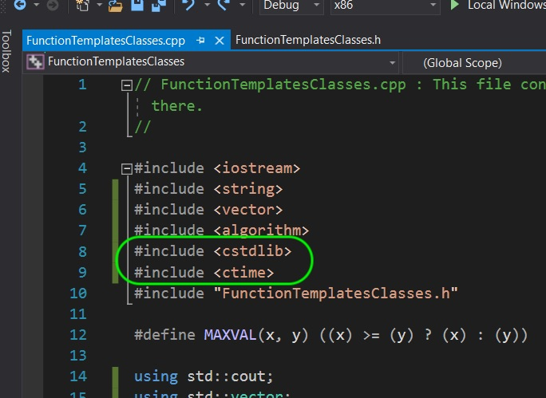

##### `Step 18.`\|`SPCRK`| :large_blue_diamond: :small_orange_diamond: :small_blue_diamond: :small_blue_diamond: :small_blue_diamond:

Call **[srand](http://www.cplusplus.com/reference/cstdlib/srand/)** and pass it the current time. This changes the seed everytime the game is run.

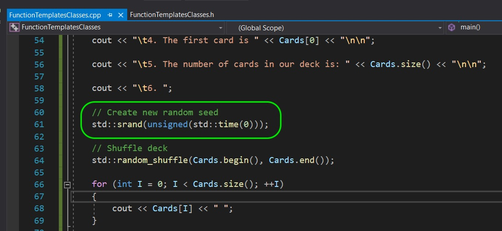

##### `Step 19.`\|`SPCRK`| :large_blue_diamond: :small_orange_diamond: :small_blue_diamond: :small_blue_diamond: :small_blue_diamond: :small_blue_diamond:

Run and compile and you will be passing a different seed each time, so your shuffle should be different each time.

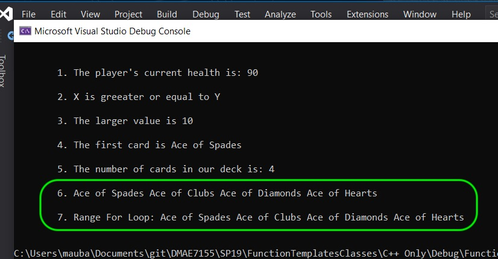

##### `Step 20.`\|`SPCRK`| :large_blue_diamond: :large_blue_diamond:

Run and compile the game to see that the value changes each time which sets a different seed and gets a different result.

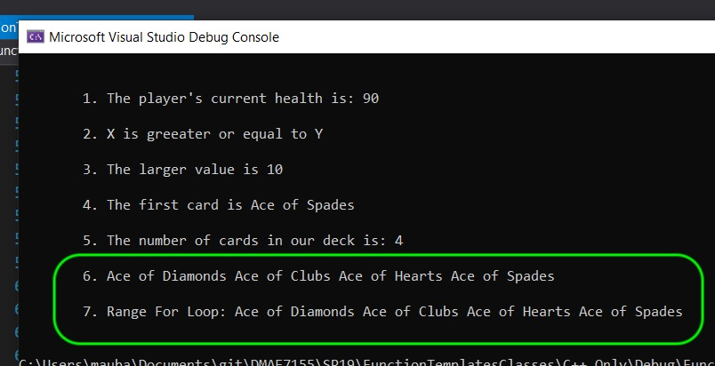

##### `Step 21.`\|`SPCRK`| :large_blue_diamond: :large_blue_diamond: :small_blue_diamond:

One of the advantages of using a container is that we can add dynamically to the array during run-time and don't need to know in advance how many items this data structure should hold. We use the `vector::push_back` function to add a string to the end of the vector. Lets add the second card to the deck:

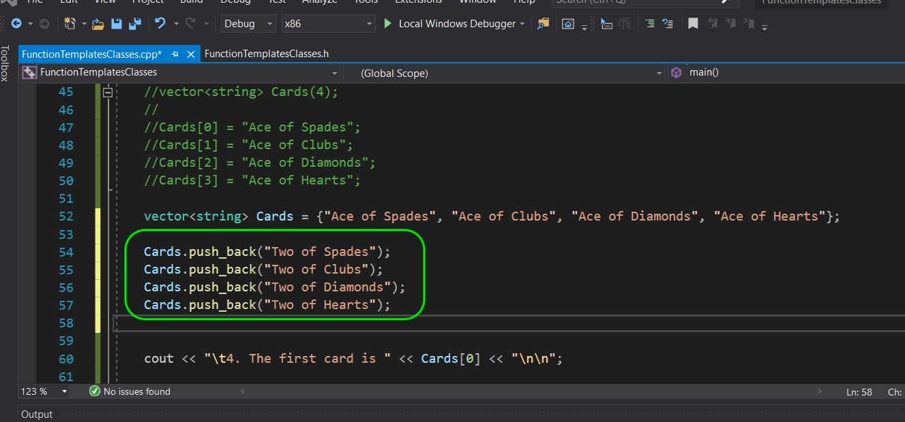

___

| [previous](../)| [home](../README.md#user-content-gms2-top-down-shooter) | [next](../)|
|---|---|---|
