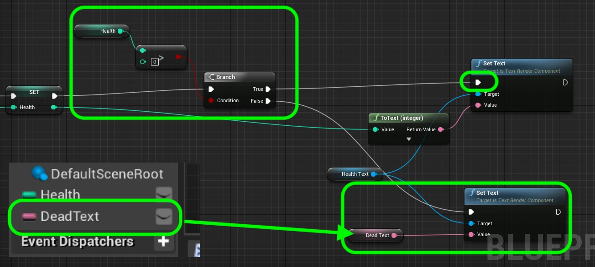
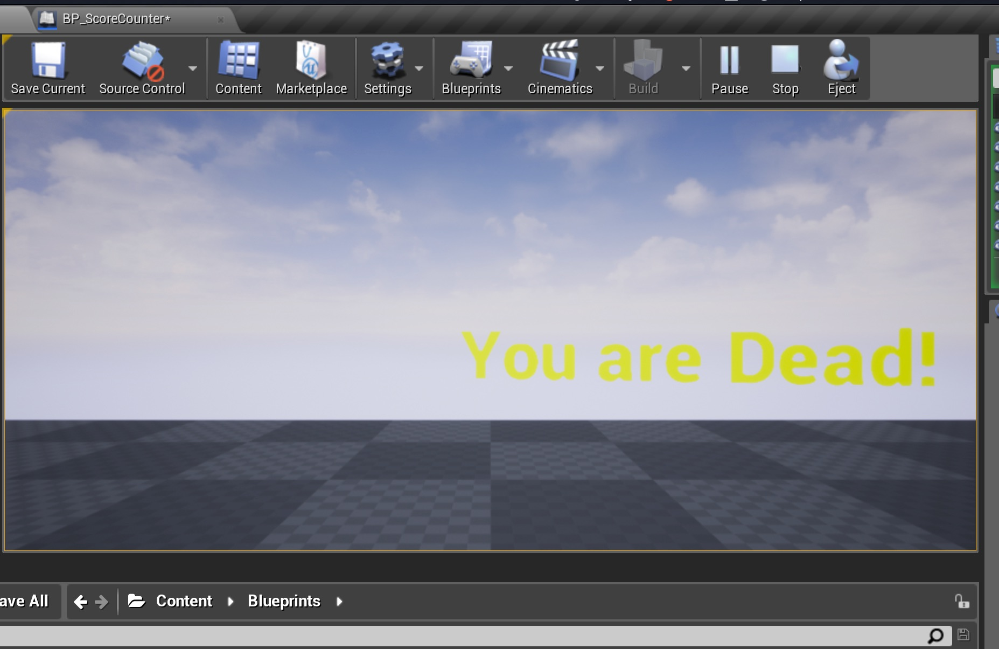

### Edge Case

[previous](../) • [home](../README.md#user-content-gms2-top-down-shooter) • [next](../)

Chapter introduction here.

 

---

##### `Step 1.`\|`SPCRK`|:small_blue_diamond:

Now I will let you complete the final step. Before setting the text component we need to verify that the score is still above 0. If it is not, set the text to display a death message. Create a new **Text** variable called `DeadText` and set this default value to `You Are Dead!`. Add it to your graph and check to see if it agove 0 and branch if it is, do what you did previously if not then set the text to this new **DeadText** variable. Your node chart should look something like this:

##### `Step 2.`\|`FHIU`|:small_blue_diamond: :small_blue_diamond: 

Compile and run the game and wait for the health to get to 0. Now you should see a **You are Dead!** text. This is not the most optimal fix as it still continues to run the text subtracting it needlessly (but not displaying it). If this was for a specific use case we would do a more permanent fix that would stop subtracting health. I assume we would do other things like kill the player etc...

| [previous](../)| [home](../README.md#user-content-gms2-top-down-shooter) | [next](../)|
|---|---|---|
