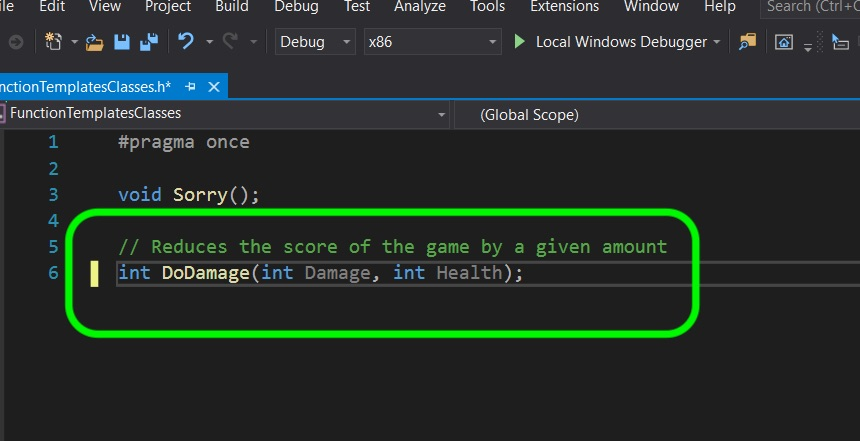
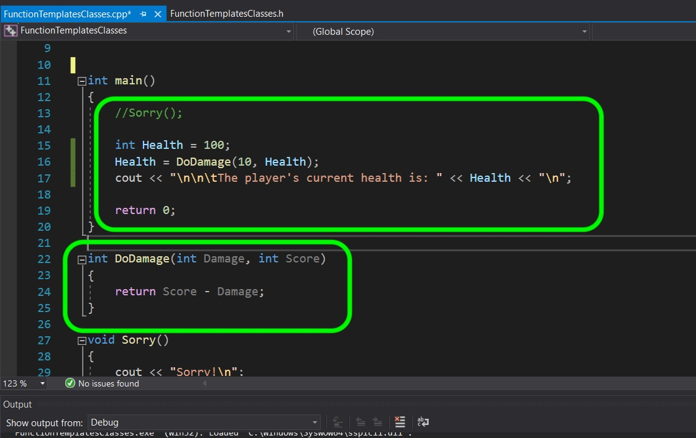
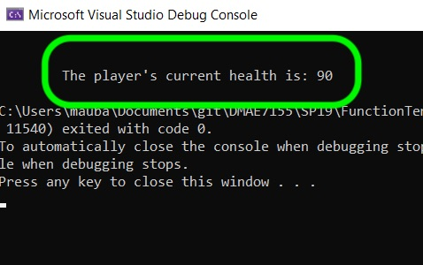

### Function with Return

[previous](../) • [home](../README.md#user-content-gms2-top-down-shooter) • [next](../)

Now lets create a function with a return value and is passed multiple parameters.

 

---

##### `Step 1.`\|`SPCRK`|:small_blue_diamond:

Add to our header file **FunctionTemplatesClasses.h** a new function declaration that does damage to player's health. We pass it the damage amount, the current health and it will return the new value.

##### `Step 2.`\|`FHIU`|:small_blue_diamond: :small_blue_diamond: 

Now open the cpp file **FunctionTemplatesClasses.cpp** and add a definition. It is the simplest function you can imagine and subtracts damage from score. The difference is that this function returns an **integer**. So we need a `return` statement to be made in the function so that it returns a value in all possible ways (in this case it is a single statement return).

Then in the `main()` function declare a **Health** variable and set update the **Health** with a damage of `10` units. Then print out the current score with the texed indented by a tab:

##### `Step 3.`\|`SPCRK`|:small_blue_diamond: :small_blue_diamond: :small_blue_diamond:

Build (cntrl B) and run (F5) the program. Notice that the score reflects the return value that the function provided (we passed it `10` and a `100` and it returned 100-10). We added a new special character `\t` which tabs the location in the console. So you can see that the `cout` starts tabulated in the console window.

| [previous](../)| [home](../README.md#user-content-gms2-top-down-shooter) | [next](../)|
|---|---|---|
