### Function Scope

[previous](../) • [home](../README.md#user-content-gms2-top-down-shooter) • [next](../)

Now we need to look at how data is moved around when calling functions in C++.  Lets look at what happens to the parameters and their scope when we send them to a function.

 

---

##### `Step 1.`\|`SPCRK`|:small_blue_diamond:

So what happens when I pass a variable as a parameter to another function.  Is the function reading the memory from the same variable?  If so then if we call this function the parameter we pass should be changed.  Lets try it out:

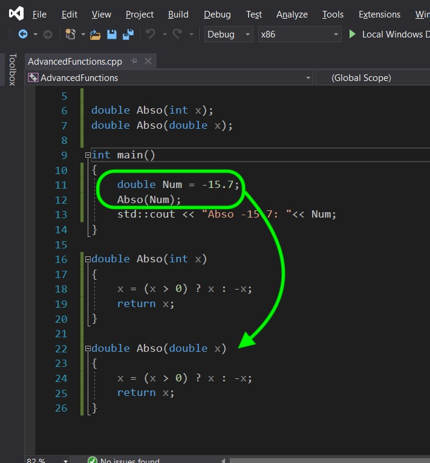

##### `Step 2.`\|`FHIU`|:small_blue_diamond: :small_blue_diamond: 

When we run it notice that the parameter is not affected it stays negative.  The program makes a copy of `Num` when it passes it to this function.  Now this isn't bad, but what if this was a data structure with all the points in a 3-D model that is 100 megabytes?  It would have to take an extra 100 megabytes of memory when it is passed to the function.  This would be slow and ineficient. 

##### `Step 3.`\|`SPCRK`|:small_blue_diamond: :small_blue_diamond: :small_blue_diamond:

There are two solutions to passing around larger data structures.  We can use **references** or **pointers**. Lets start by looking at a **[reference](https://en.cppreference.com/w/cpp/language/reference)** declaration.  This creates a reference to a built in or created type. This creates an alias that points to the same object/variable regardless of where it is located in memory.

##### `Step 4.`\|`SPCRK`|:small_blue_diamond: :small_blue_diamond: :small_blue_diamond: :small_blue_diamond:

We declare a variable to be a reference by putting an `&` after the type when a variable or object is initialized. This reference is identical to using the original variable.  

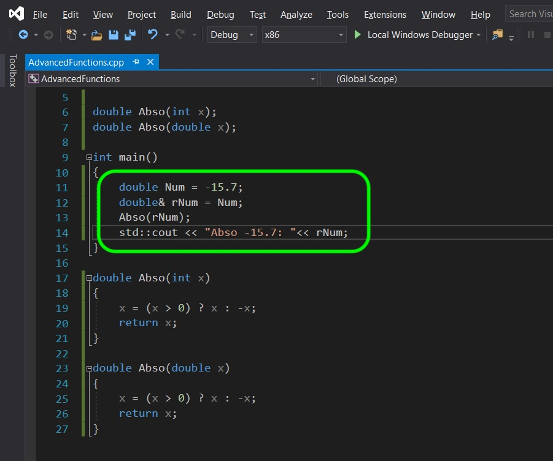

##### `Step 5.`\|`SPCRK`| :small_orange_diamond:

When we run the program the exact same thing happens. So we can use `Num` and `rNum` interchangably and they will affect the same data in exactly the same way.

##### `Step 6.`\|`SPCRK`| :small_orange_diamond: :small_blue_diamond:

So one of the things we can do with a reference, is pass this reference to a function and it can then change the underlying variable.  It doesn't make a copy but instead affects the original variable that the alias points to.  We do this by including an `&` after the type in the parameter we send.

##### `Step 7.`\|`SPCRK`| :small_orange_diamond: :small_blue_diamond: :small_blue_diamond:

So lets alter the declaration and definition otionf the functions we are using.  Add an `&` after the type in the parameters we pass.  Now when the function is called, it will alter the original `Num` variable that `rNum` is referring to.

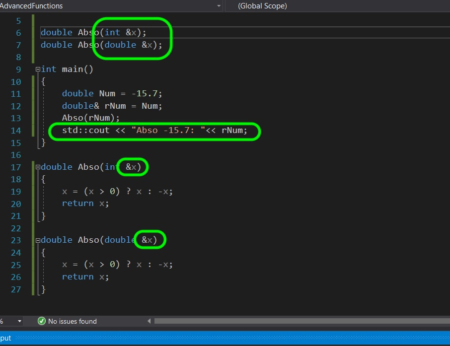

##### `Step 8.`\|`SPCRK`| :small_orange_diamond: :small_blue_diamond: :small_blue_diamond: :small_blue_diamond:

Now when we run it, notice that the original value changes (try outputing `rNum` and `Num`, you should get the same result). So instead of duplicating this value it sends an alias.  Be warned, this means the fucntion can change those parameters. This is not a good example of why we would use a rerence and is just an example.

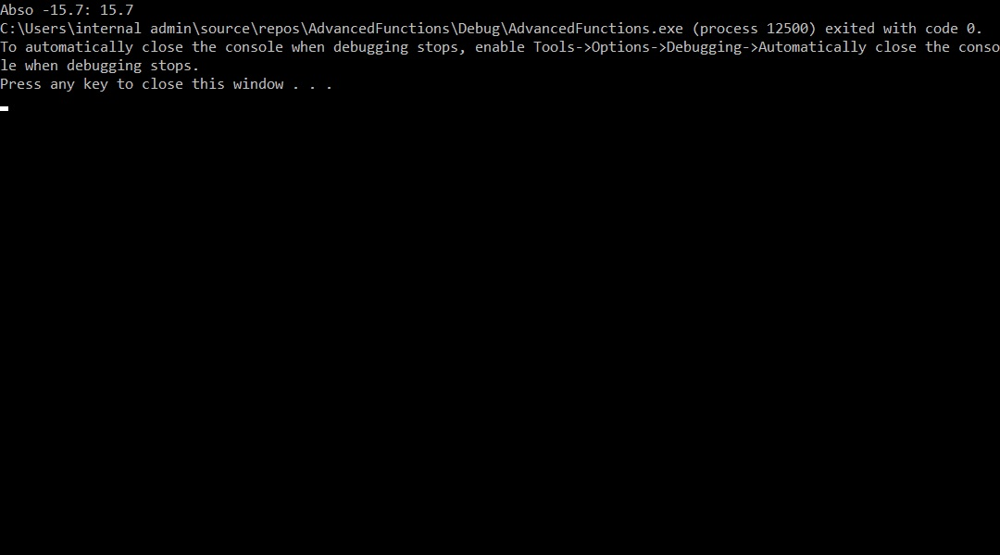

##### `Step 9.`\|`SPCRK`| :small_orange_diamond: :small_blue_diamond: :small_blue_diamond: :small_blue_diamond: :small_blue_diamond:

Now the other way we can pass information around is with a **[pointer](http://www.cplusplus.com/doc/tutorial/pointers/)**.  This stores the memory location for where the information is located.  Unlike a reference which isd always linked to its reference, we can change the location of the memory it is pointing to and change which object/variable it is pointing to.  A pointer is declared by placing `*` after the type in the variable declaration.  

##### `Step 10.`\|`SPCRK`| :large_blue_diamond:

So lets declare a pointer like we did the reference.  Create a new variable called `pNum` and set it to point to the memory location of `Num`.  Press compile.  Notice a series of errors.  One to pay attention to as we will see a lot of it in Unreal is **cannot convert from double to double*. 

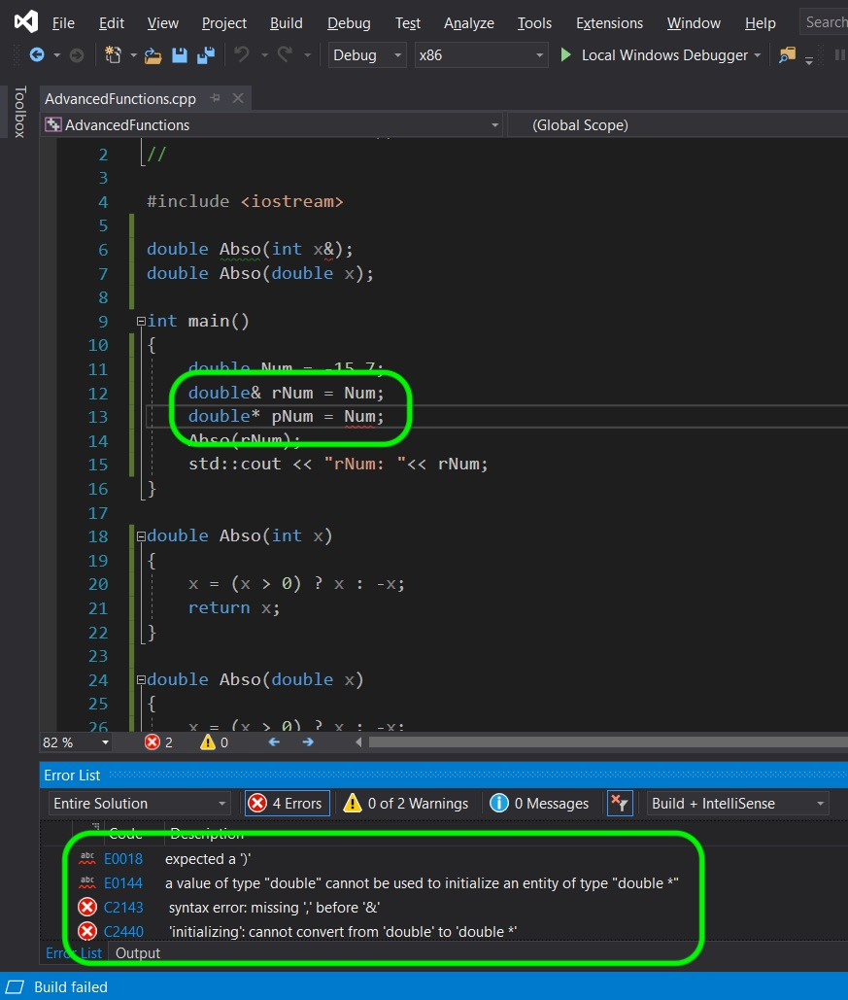

##### `Step 11.`\|`SPCRK`| :large_blue_diamond: :small_blue_diamond: 

We also need to add an `&` before a variable name to get the memory address of where it is located and passes it to the pointer. Lets also print the output of `rNum` and see if it is the same as `Num`.

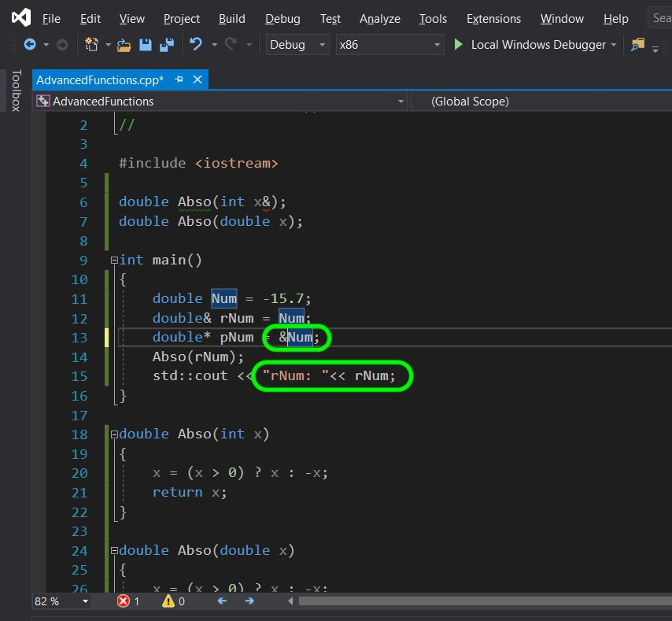

##### `Step 12.`\|`SPCRK`| :large_blue_diamond: :small_blue_diamond: :small_blue_diamond: 

Now compile and run. Woops instead of seeing the double we see `005DF85C`.  Now it will most likely be different in your computer as this is pointing to memory on my computer.  Memory addresses are stored in **[hexadecimal](https://en.wikipedia.org/wiki/Hexadecimal)** values. Now please be aware that this memory location will not always contain this value. When using pointers we need to be VERY careful.

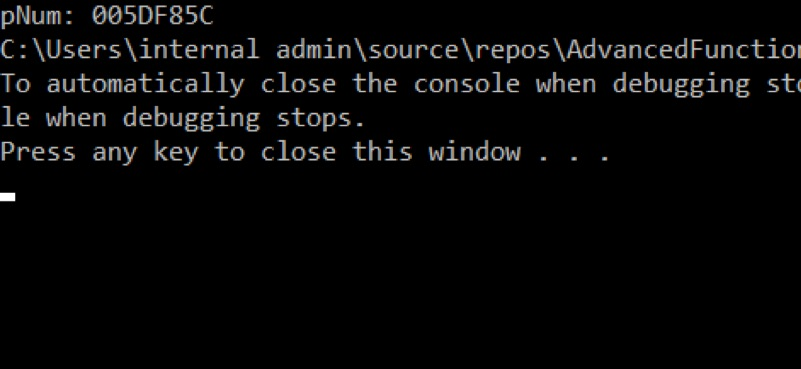

##### `Step 13.`\|`SPCRK`| :large_blue_diamond: :small_blue_diamond: :small_blue_diamond:  :small_blue_diamond: 

So how can we see the original value of what this memory is pointing to?  There is a way to change that pointer to display the contents of the memory.  It is called **dereferencing**.  So any variable that holdw a pointer can show its content by putting an `*` before the name.

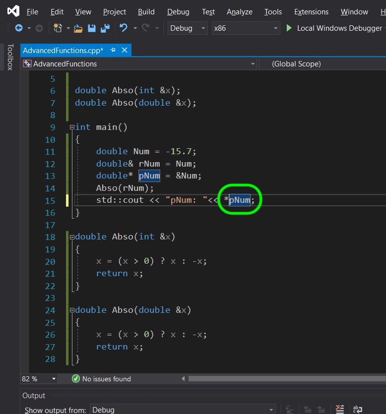

##### `Step 14.`\|`SPCRK`| :large_blue_diamond: :small_blue_diamond: :small_blue_diamond: :small_blue_diamond:  :small_blue_diamond: 

Now compile and run and notice that we no longer see what ther variable actually holds (a memory address) but we see the underlying data that is inside that memory location.

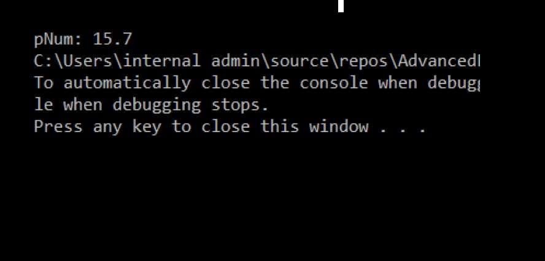

##### `Step 15.`\|`SPCRK`| :large_blue_diamond: :small_orange_diamond: 

Now we can also pass a pointer to a function and it will allow the function to access and change that memory location that is sent.

##### `Step 16.`\|`SPCRK`| :large_blue_diamond: :small_orange_diamond:   :small_blue_diamond: 

Alter the `Abso()` params from a reference (`&`) to a pointer (`*`).  Also in the definition you will need to dereference ths parameter each time you want to affect its underlying value.

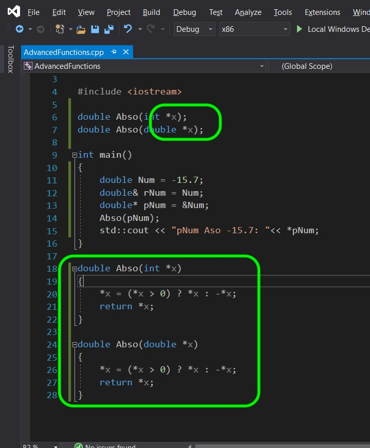

##### `Step 17.`\|`SPCRK`| :large_blue_diamond: :small_orange_diamond: :small_blue_diamond: :small_blue_diamond:

Compile and run, and you should see that the underlying value was changed by the dereferenced point!

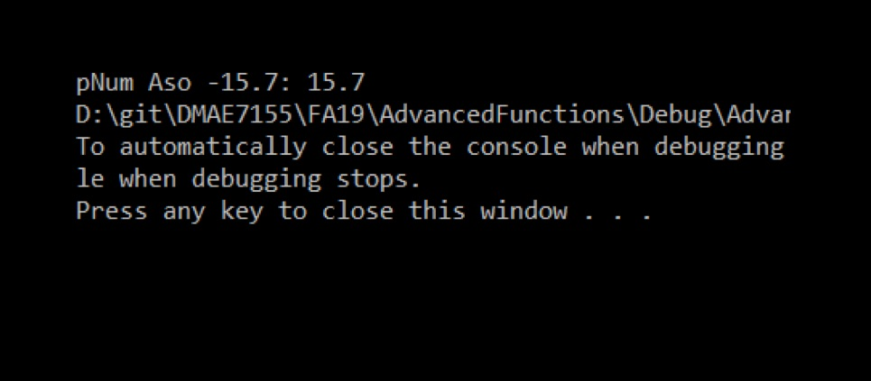

##### `Step 18.`\|`SPCRK`| :large_blue_diamond: :small_orange_diamond: :small_blue_diamond: :small_blue_diamond: :small_blue_diamond:

___

| [previous](../)| [home](../README.md#user-content-gms2-top-down-shooter) | [next](../)|
|---|---|---|
