### Functions in Blueprints

[previous](../) • [home](../README.md#user-content-gms2-top-down-shooter) • [next](../)

Now lets see how to create a function in Blueprints.

 

---

##### `Step 1.`\|`SPCRK`|:small_blue_diamond:

Open up the **Epic Games Launcher** program and to to the **Unreal Engine \| Library** tab. Press on the version **4.24.1 Launch** button to start a new project.

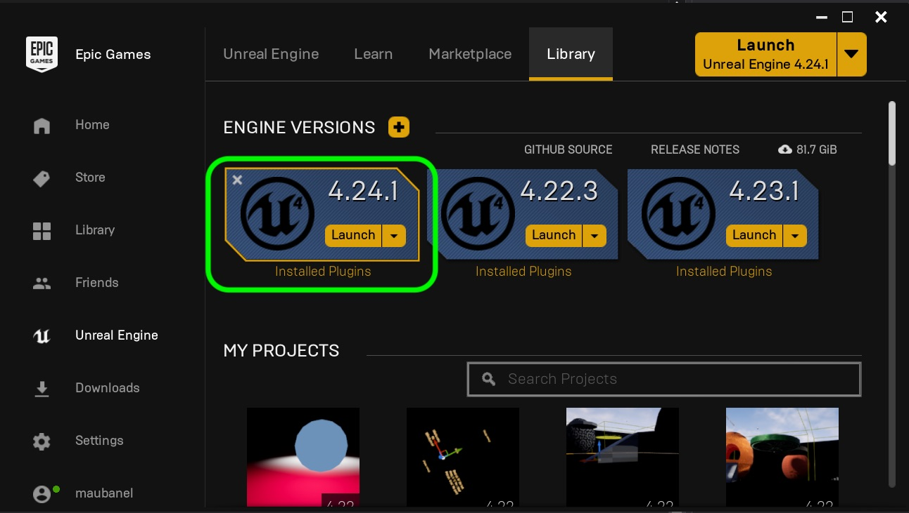

##### `Step 2.`\|`FHIU`|:small_blue_diamond: :small_blue_diamond: 

Select the **Blank** template and press **Next**.

Select **Games** from the menu then press the **Next** button.

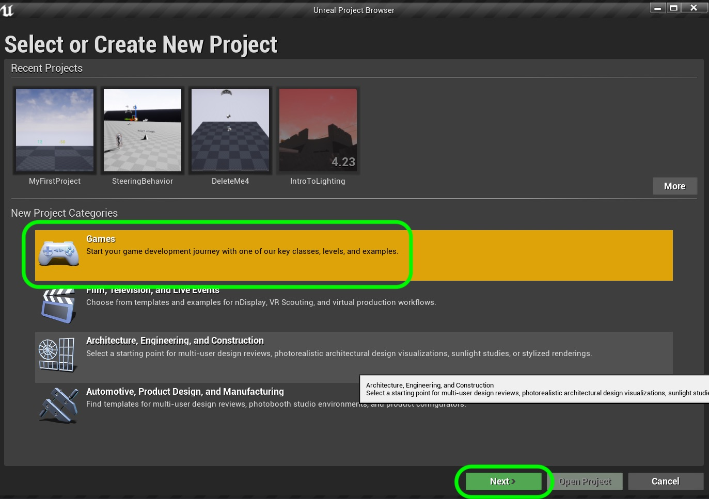

##### `Step 3.`\|`SPCRK`|:small_blue_diamond: :small_blue_diamond: :small_blue_diamond:

Select the **Blank** template and press **Next**.

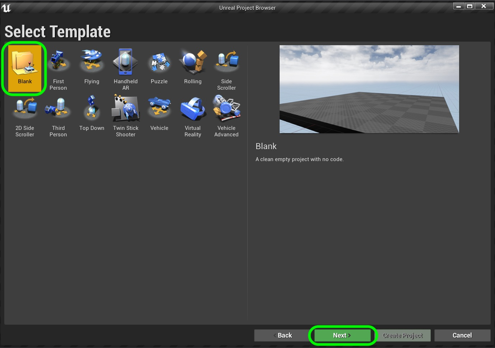

##### `Step 4.`\|`SPCRK`|:small_blue_diamond: :small_blue_diamond: :small_blue_diamond: :small_blue_diamond:

Select the **C++** type game in the top left tab. The project needs no starter content, set the quality to whatever is best for your computer and the target should be **Desktop / Console**. Select a directory and call the project `TestFunctions`.

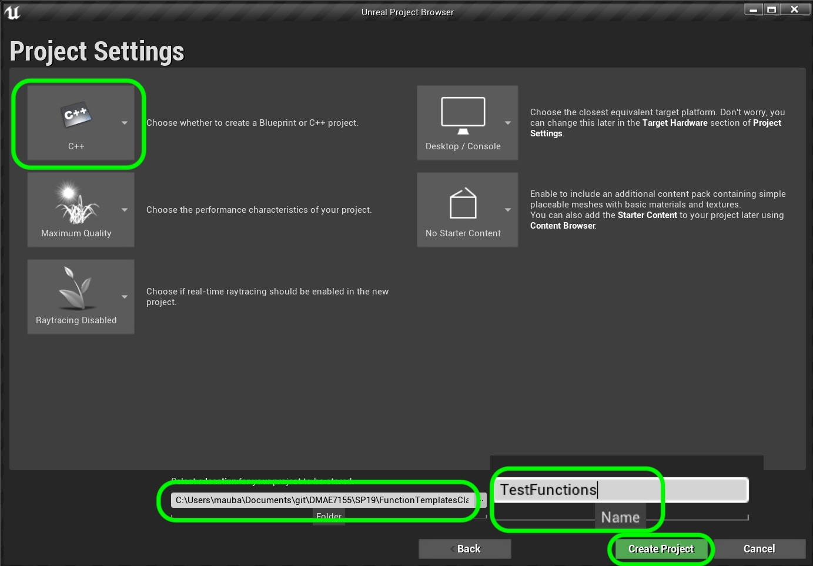

##### `Step 5.`\|`SPCRK`| :small_orange_diamond:

In the content browser press the **Add New** button and create two new folders, one called `Maps` and the other called `Blueprints`.

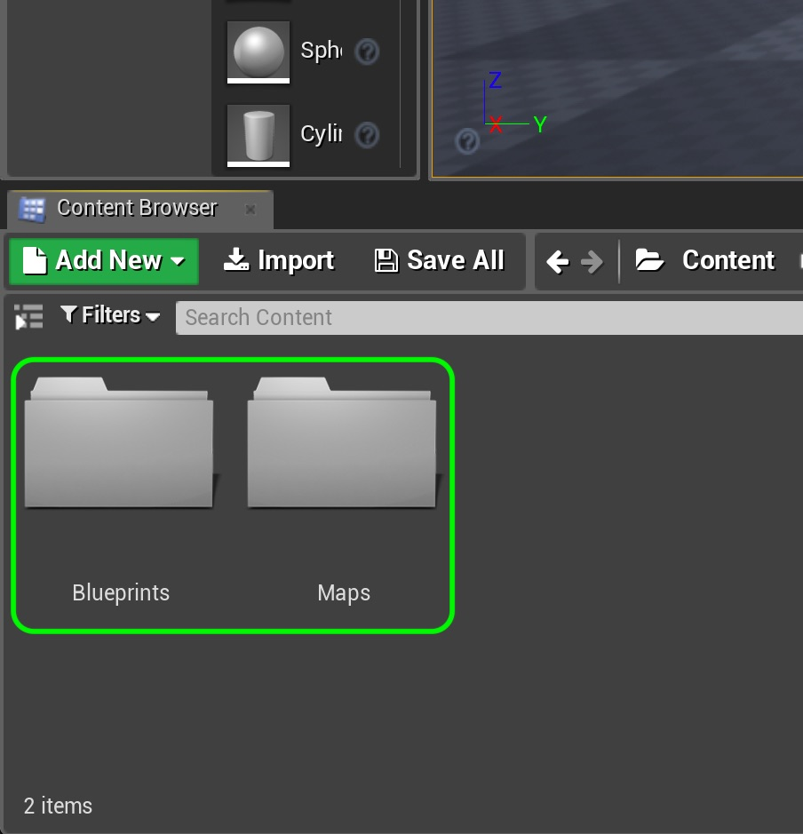

##### `Step 6.`\|`SPCRK`| :small_orange_diamond: :small_blue_diamond:

Navigate to the maps folder and press **File \| Save Current** to save the current map and call it `HealthDisplayLevel`.

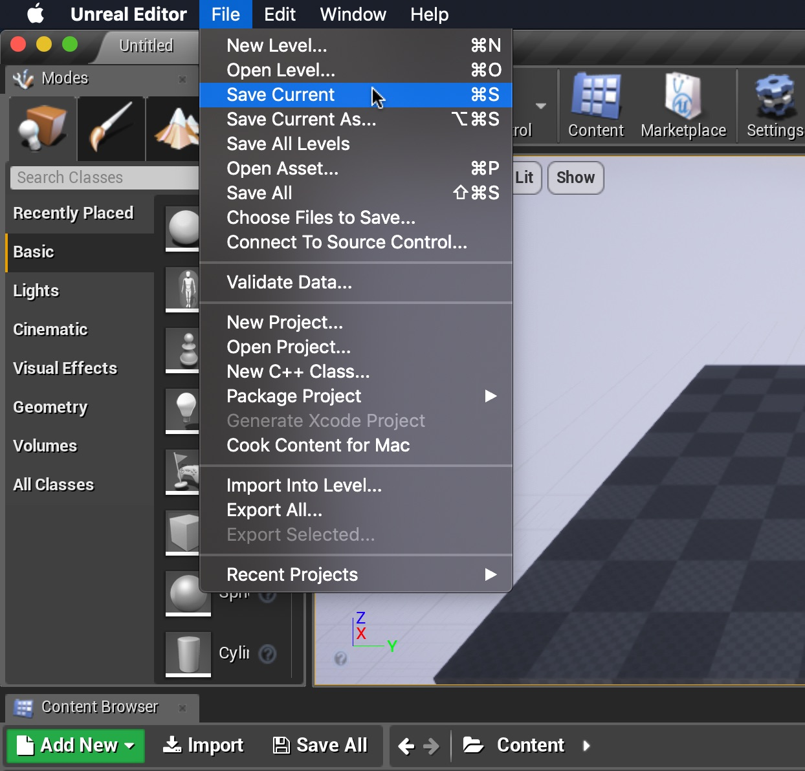

##### `Step 7.`\|`SPCRK`| :small_orange_diamond: :small_blue_diamond: :small_blue_diamond:

Navigate to the **Blueprints** folder. In the **Content Browser** select **Add New \| Blueprint Class** and pick the **Actor** class as we have done previously. Call this new blueprint `BP_HealthCounter`.

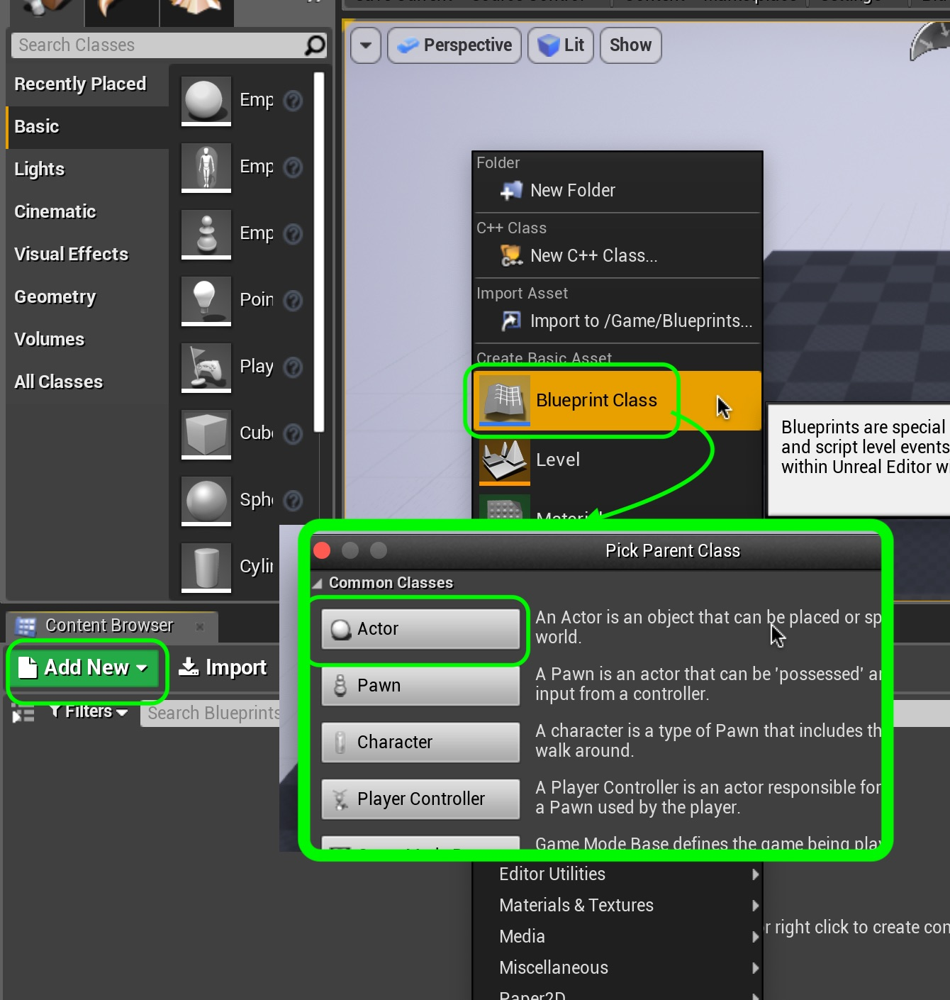

##### `Step 8.`\|`SPCRK`| :small_orange_diamond: :small_blue_diamond: :small_blue_diamond: :small_blue_diamond:

Now open this newly created Blueprint and press the **+ Add Component** button and select a **Text Render** component.

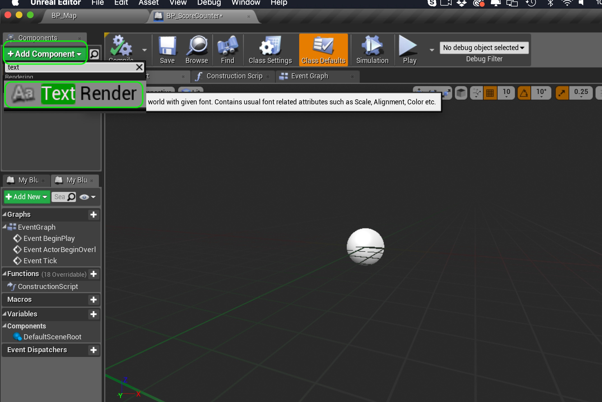

##### `Step 9.`\|`SPCRK`| :small_orange_diamond: :small_blue_diamond: :small_blue_diamond: :small_blue_diamond: :small_blue_diamond:

Name this component `HealthText` and change the **Text** to `100`. Set the **Text Render Color** to a contrasting color with the sky.

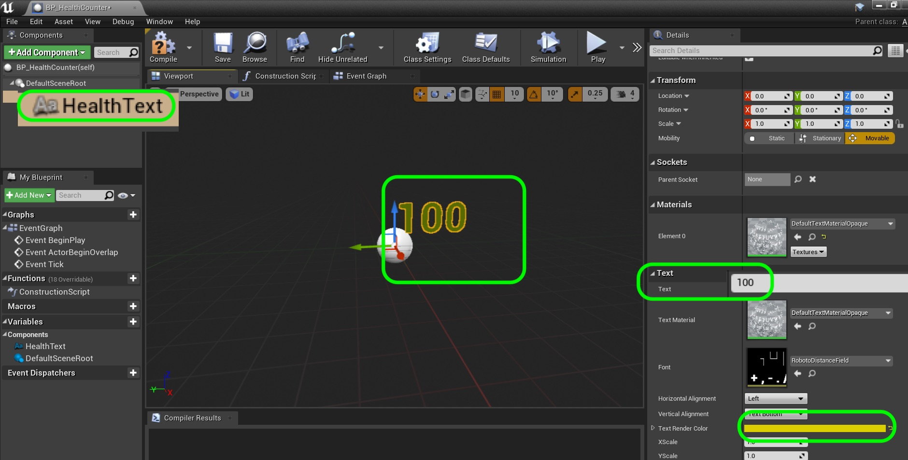

##### `Step 10.`\|`SPCRK`| :large_blue_diamond:

 Let's create the same function we just did in C++ in a blueprint. Press the **+ Function** button to create a new function and name this new function `DoDamage`.

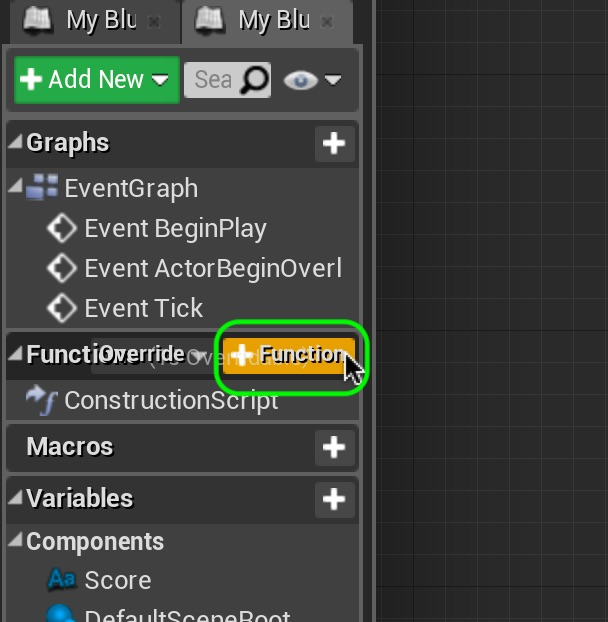

##### `Step 11.`\|`SPCRK`| :large_blue_diamond: :small_blue_diamond: 

This creates a new tab called **Do Damage** and notice that there is a node with the name of the function and an execution pin. When it is called the execution pin will run. Now the parameters we pass to the function are called **Inputs** and the return type is called **Outputs**. Please note that in C++ you can only return one value but in blueprints we can return multiple values.

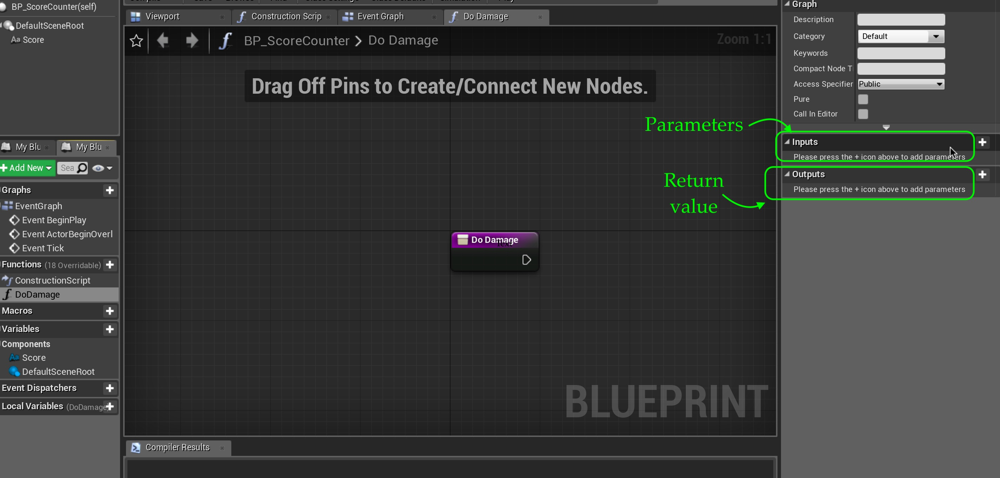

##### `Step 12.`\|`SPCRK`| :large_blue_diamond: :small_blue_diamond: :small_blue_diamond: 

Add an output of type **Integer** with the name of `New Health`. Add two inputs called `Damage` and `Health` each of type **Integer**. Notice that a **Return** node is added when you added an **Output** to the function.

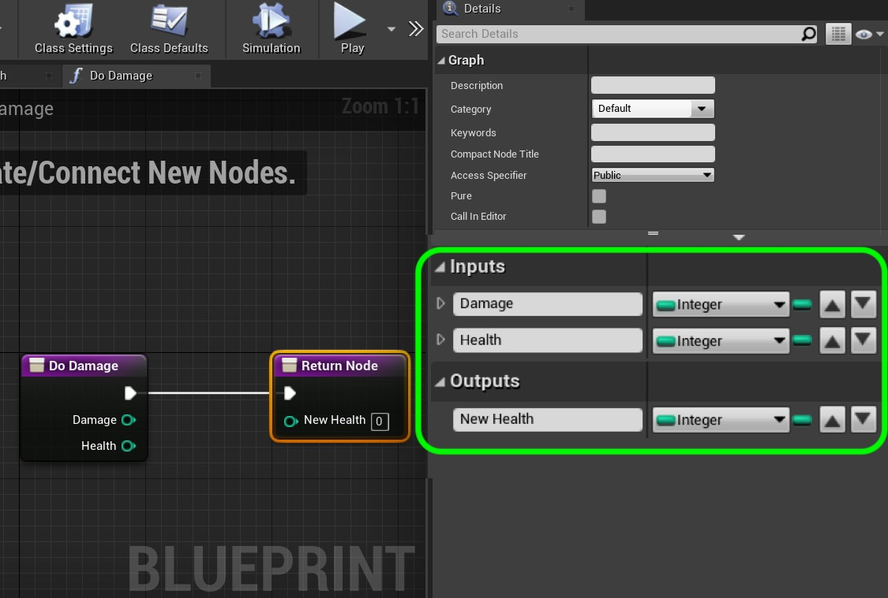

##### `Step 13.`\|`SPCRK`| :large_blue_diamond: :small_blue_diamond: :small_blue_diamond:  :small_blue_diamond: 

Now pull off of the **Health** output pin and select an **Integer - Integer** node. Notice that it has a green **f** next to it which indicates that this is a function as well. It is a built in function that comes with the engine.

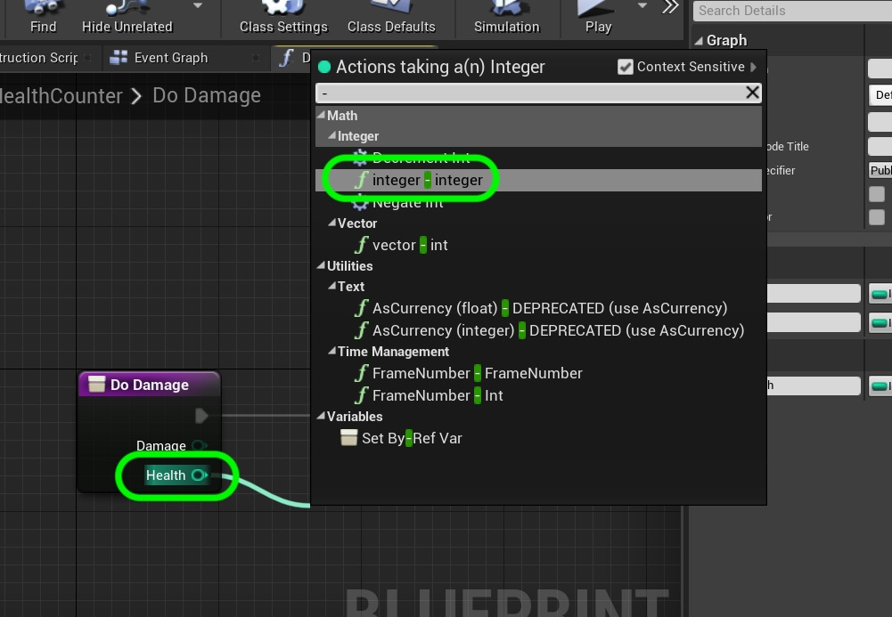

##### `Step 14.`\|`SPCRK`| :large_blue_diamond: :small_blue_diamond: :small_blue_diamond: :small_blue_diamond:  :small_blue_diamond: 

Connect the pins making sure that you are deducting **Damage** from **Score** then sending the outut to the **Return Node's New Score** input pin:

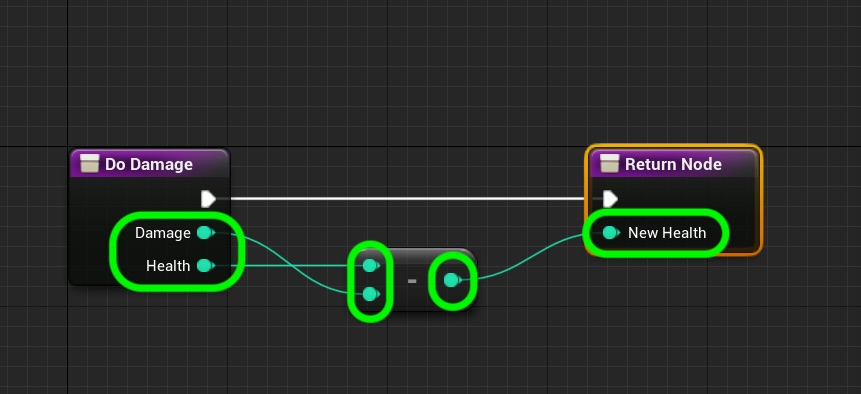

##### `Step 15.`\|`SPCRK`| :large_blue_diamond: :small_orange_diamond: 

 Lets go back to the **Event Graph** and right click on the empty graph next to the **Event Tick** and add a **Delay** node:

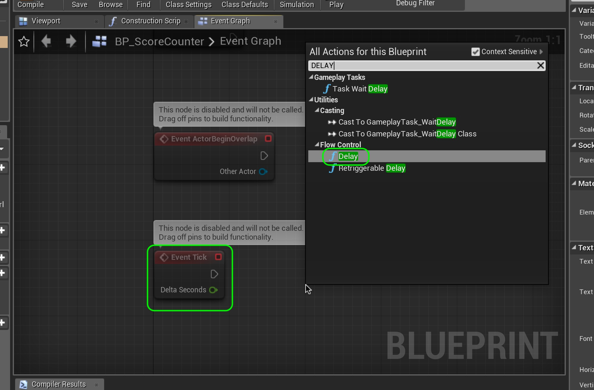

##### `Step 16.`\|`SPCRK`| :large_blue_diamond: :small_orange_diamond:   :small_blue_diamond: 

Change the duration to `2.0` and pull off the **Completed** execution pin and select the **Do Damage** function you just wrote.

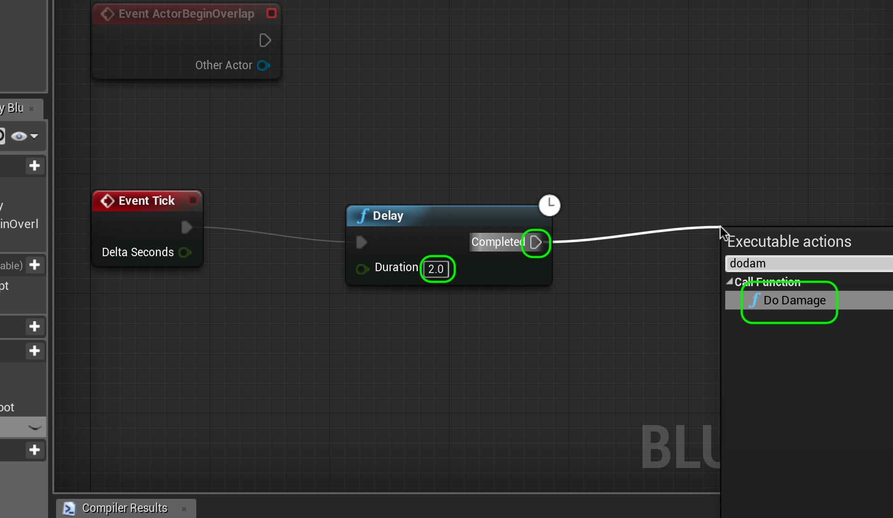

##### `Step 17.`\|`SPCRK`| :large_blue_diamond: :small_orange_diamond: :small_blue_diamond: :small_blue_diamond:

 Create a new **Variable** and call it `Health` and make it type **Integer**. Press the **Compile** button and change the **Default Value** to `100`.

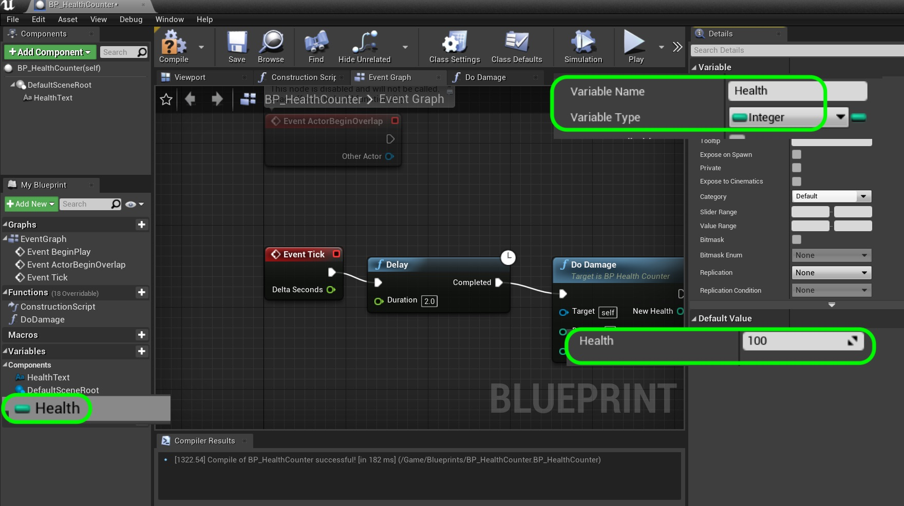

##### `Step 18.`\|`SPCRK`| :large_blue_diamond: :small_orange_diamond: :small_blue_diamond: :small_blue_diamond: :small_blue_diamond:

Drag a **Get Health** reference to the graph and connect it to the **Health** input pin in the **DoDamage** function. Add a **Random Integer in Rage** node and set the **Min** to `1` and the **Max** to `5`. Send the **Return Value** to the **Damage** parameter in **Do Damage**.

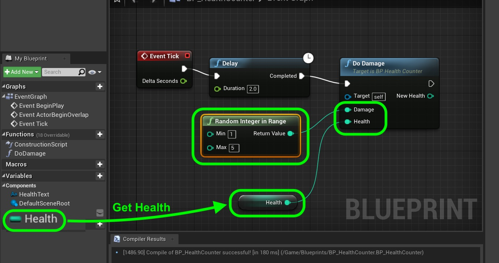

##### `Step 19.`\|`SPCRK`| :large_blue_diamond: :small_orange_diamond: :small_blue_diamond: :small_blue_diamond: :small_blue_diamond: :small_blue_diamond:

Add a **Set Health** reference node and connect its execution pin to **Do Damage** and pipe the **New Health** return value to it's input **Health** pin.

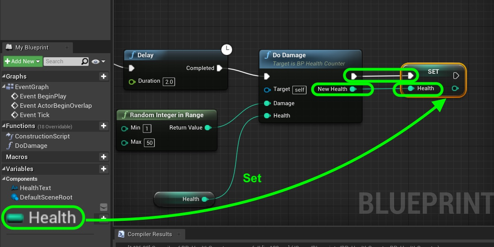

##### `Step 20.`\|`SPCRK`| :large_blue_diamond: :large_blue_diamond:

Drag a copy of the **Health Text** component to the graph and pull off of its pin to select a **Set Text** node.

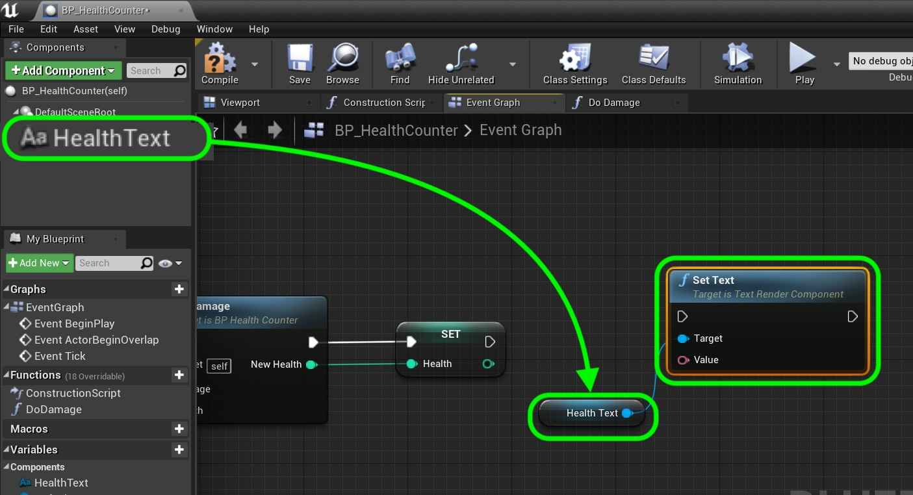

##### `Step 21.`\|`SPCRK`| :large_blue_diamond: :large_blue_diamond: :small_blue_diamond:

Connect execution pin from **Set Score** to **Set Text**. Your node chart should now look like this:

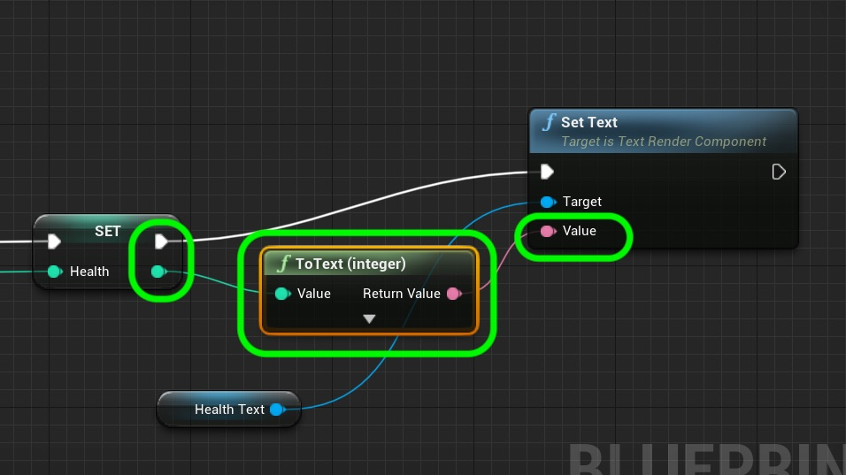

___

##### `Step 21.`\|`SPCRK`| :large_blue_diamond: :large_blue_diamond: :small_blue_diamond:

Go to the game and add the **BP_ScoreCounter** to the scene in front of the player. Press the **Compile** button and run the game. Notice that if you keep running the game it will go below zero. Lets fix that up on the next page.

___

| [previous](../)| [home](../README.md#user-content-gms2-top-down-shooter) | [next](../)|
|---|---|---|
