### Macros

[previous](../) • [home](../README.md#user-content-gms2-top-down-shooter) • [next](../)

Macros in C++ are different than Macros in blueprints. We will cover blueprint Macros later. But since we were using macros for UPROPERTY and UFUNCTION it would be good to explain what these are.

A macro is a preprocessor directive that is preceded by a hash sign #. These lines are resolved by the pre processor before the compilation begins.

Lets add a restart so that when the health gets to 0 it resets to a new value (just for testing) 400. We will do this initially by using Macros.

 

---

##### `Step 1.`\|`SPCRK`|:small_blue_diamond:

A macro just replaces the text you provide with another value. Go back to the TestFunctions Unreal project and open up **HealthCounter_CPP.h** and add `#define RESETHEALTH 400`. Notice that it is very similar to the preprocessor directive to include other header files. It starts with a `#` pound sign and then it is customary to name all macros with ALLCAPS. The preprocessor will replace the RESETHEALTH with the number 400.

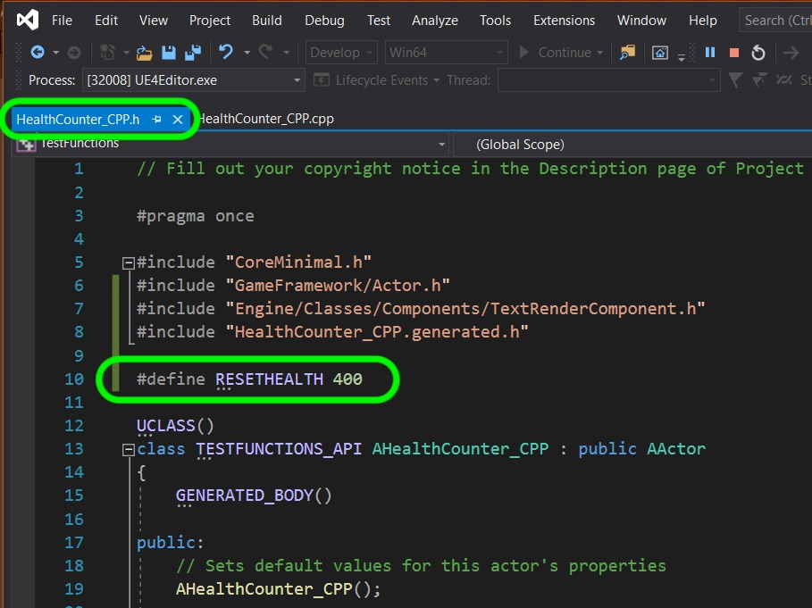

##### `Step 2.`\|`FHIU`|:small_blue_diamond: :small_blue_diamond: 

 Lets declare a new function `void ResetHealth()` where we will reset the score to a desired constant value. Lets also make it accessible in blueprints by including the UFUNCTION macro.

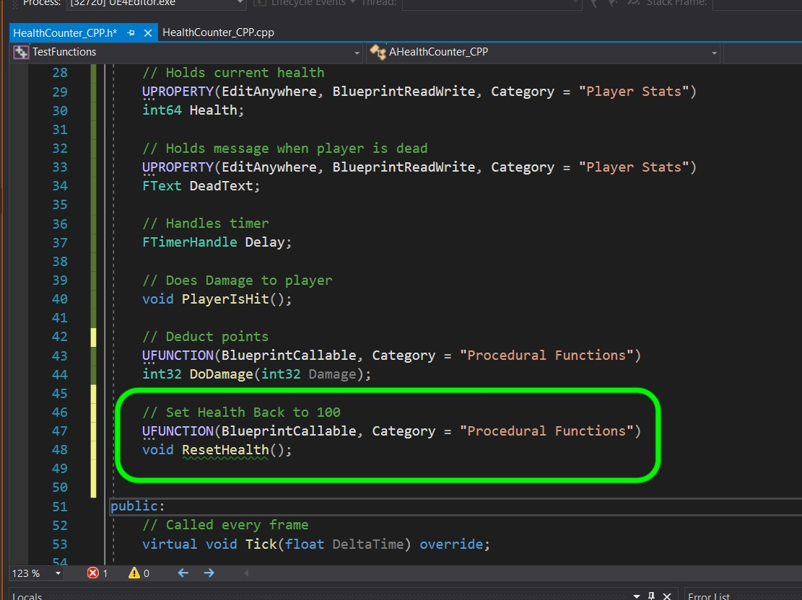

##### `Step 3.`\|`SPCRK`|:small_blue_diamond: :small_blue_diamond: :small_blue_diamond:

Now go to the `.ccp` file and add a function definition setting the Health to the macro constant. Then update the display text. Make sure you build the project and make sure there are no compile errors.

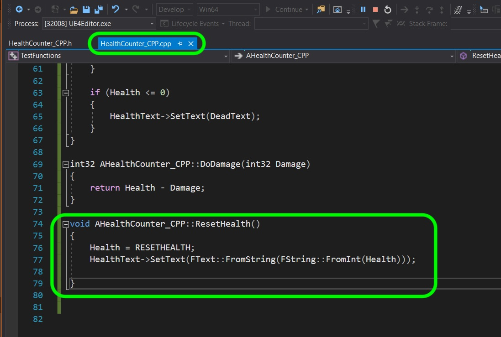

##### `Step 4.`\|`SPCRK`|:small_blue_diamond: :small_blue_diamond: :small_blue_diamond: :small_blue_diamond:

Now to restart the game we want to call **PlayerIsHit** in a blueprint after the player's health gets to 0. Go back to the `.h` file and add the required macro:

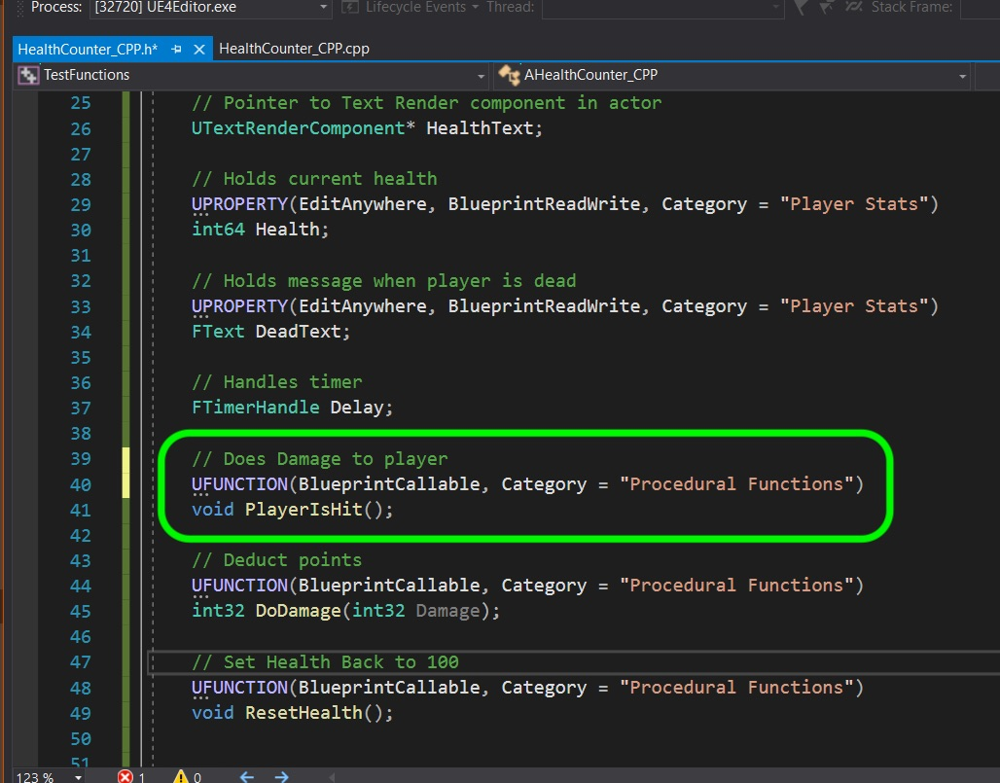

##### `Step 5.`\|`SPCRK`| :small_orange_diamond:

Now open up **BP_HealthCounter_CPP** and add the following logic:

When Health is less or equal to zero then wait 5 seconds, run the **ResetHealth** function, wait another 2 seconds, then run **PlayerIsHit** to start the recursive function again.

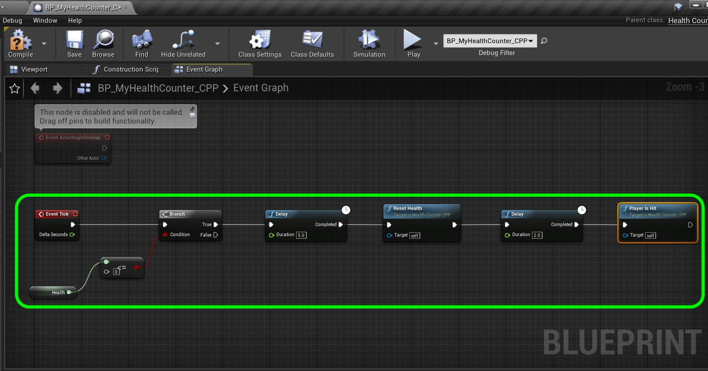

##### `Step 6.`\|`SPCRK`| :small_orange_diamond: :small_blue_diamond:

We have a bug in our logic. Open up the definition for **PlayerIsHit()** and change the `else` to `if (Health <= 0)`. This is because the previous if catches Health when it is above `0` but then subtracts a random amount. We need to check AGAIN if **Health** is now less than zero.

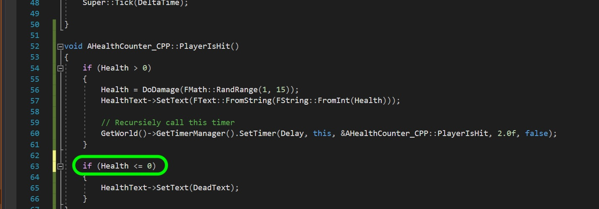

##### `Step 7.`\|`SPCRK`| :small_orange_diamond: :small_blue_diamond: :small_blue_diamond:

Compile the blueprint then run the game. It should start at the value you set in the editor then goes to `400` which is what the MACRO replacement peforms once the score gets to 0.

##### `Step 8.`\|`SPCRK`| :small_orange_diamond: :small_blue_diamond: :small_blue_diamond: :small_blue_diamond:

 Quit Unreal and reopen the **FunctionTemplayClasses** solution file we created previously. Lets first look at `?` conditional operator. First lets type in an `if` - `else` conditional statement.

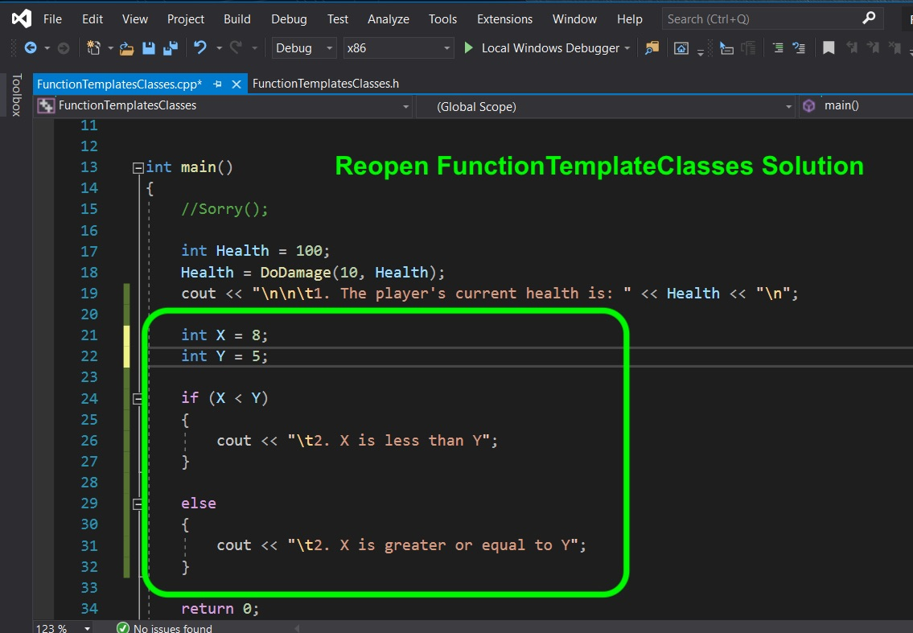

##### `Step 9.`\|`SPCRK`| :small_orange_diamond: :small_blue_diamond: :small_blue_diamond: :small_blue_diamond: :small_blue_diamond:

We can replace this multipline if else statement with a single line. We can define a string and we put a `?` after the conditional statement then if the condition is true what is on the right hand of the `?` is used and if false then what is on the right hand side of `:`. So the keyword `if` is replaced with `?` (but placed after the condition) and `else` is replaced with `:`. This allows us to save space and express the condition more concisely.

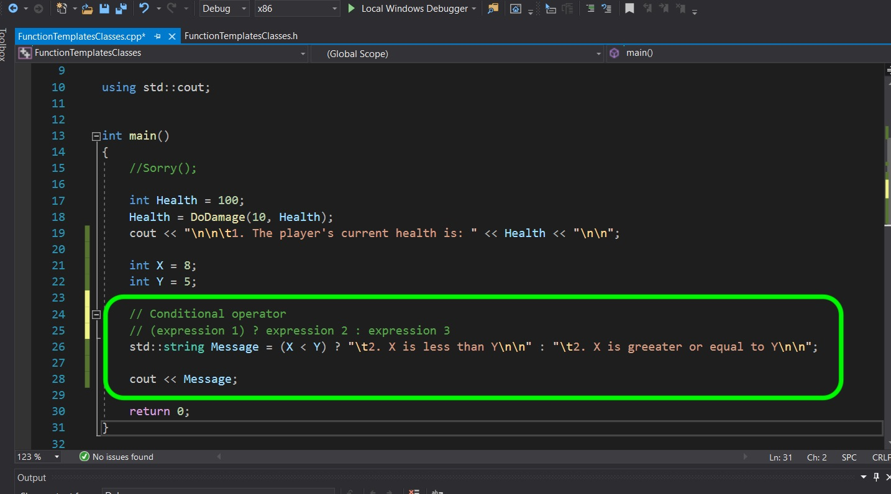

##### `Step 10.`\|`SPCRK`| :large_blue_diamond:

 Press **F5** to compile and run and you should get the same result as the multiline if else statement.

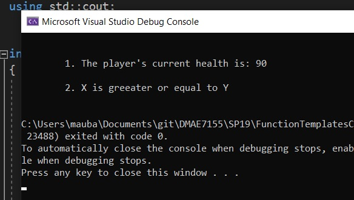

##### `Step 11.`\|`SPCRK`| :large_blue_diamond: :small_blue_diamond: 

 Lets get back to Macros. Now we can **also** have one line Macro functions. Here is one that returns the larger value of the two passed to it.

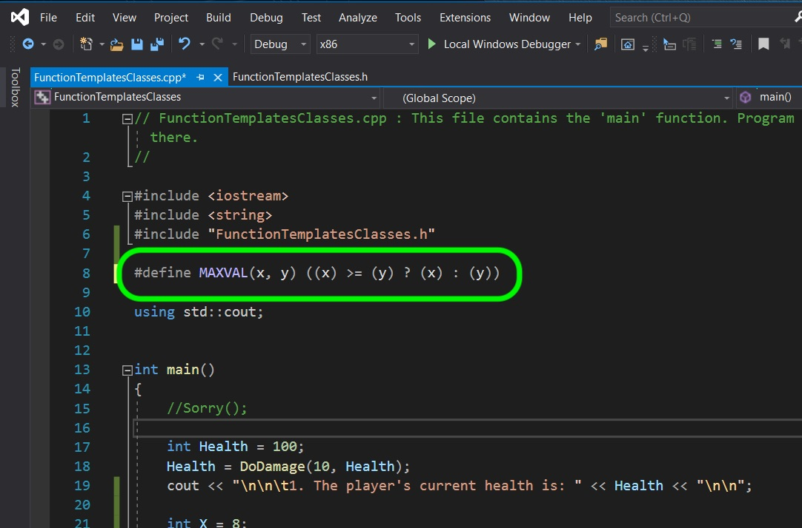

##### `Step 12.`\|`SPCRK`| :large_blue_diamond: :small_blue_diamond: :small_blue_diamond: 

 Lets call this new macro function.

##### `Step 13.`\|`SPCRK`| :large_blue_diamond: :small_blue_diamond: :small_blue_diamond:  :small_blue_diamond: 

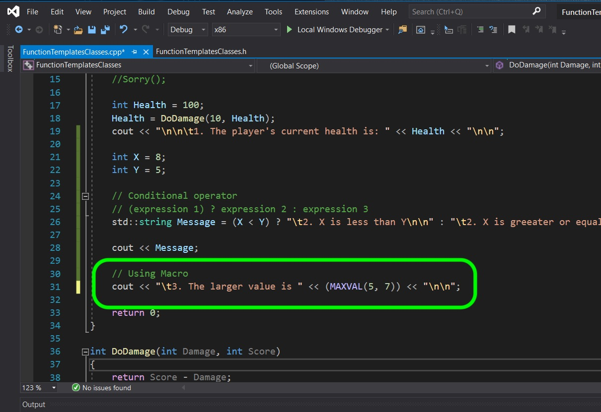

##### `Step 14.`\|`SPCRK`| :large_blue_diamond: :small_blue_diamond: :small_blue_diamond: :small_blue_diamond:  :small_blue_diamond: 

When you build and run it you should see it select `7` as the larger number.

##### `Step 15.`\|`SPCRK`| :large_blue_diamond: :small_orange_diamond: 

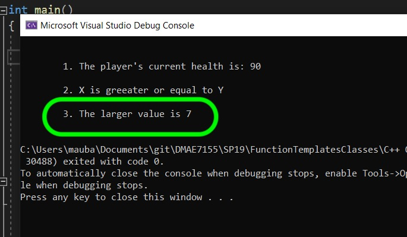

##### `Step 16.`\|`SPCRK`| :large_blue_diamond: :small_orange_diamond:   :small_blue_diamond: 

Lets do the same thing but pass it two variables instead.

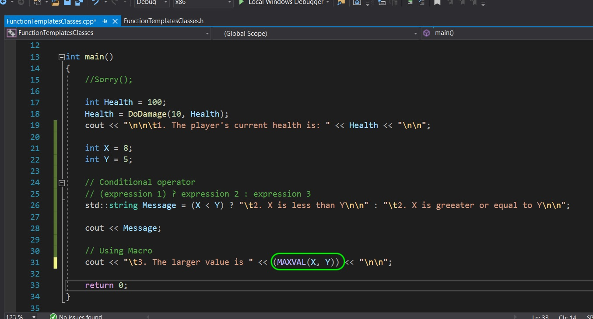

##### `Step 17.`\|`SPCRK`| :large_blue_diamond: :small_orange_diamond: :small_blue_diamond: :small_blue_diamond:

Now build and run it and it works as expected returning an `8`.

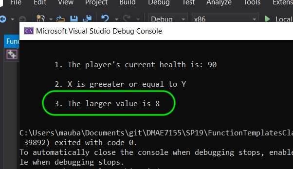

##### `Step 18.`\|`SPCRK`| :large_blue_diamond: :small_orange_diamond: :small_blue_diamond: :small_blue_diamond: :small_blue_diamond:

Many issues can arise with macros as it can unexpected behaviors. For example if you pass an argument with another effect to a Macro you can get unexpected results. Look at the following.

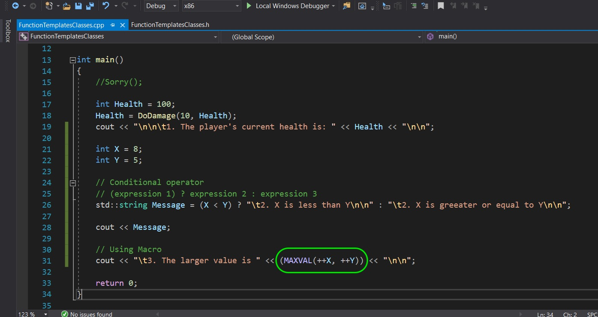

##### `Step 19.`\|`SPCRK`| :large_blue_diamond: :small_orange_diamond: :small_blue_diamond: :small_blue_diamond: :small_blue_diamond: :small_blue_diamond:

Build and run and you expected to see the number `9` didn't you?

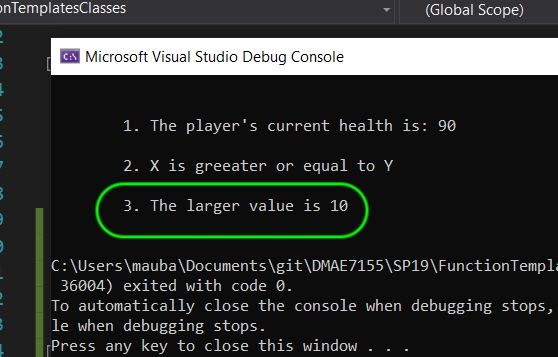

##### `Step 20.`\|`SPCRK`| :large_blue_diamond: :large_blue_diamond:

Why did this happen? It took `MAXVAL(++j, ++i)` expands to if `(++j) > (++i) : (++j) : (++i)`. Notice that it runs **++j** anbd **++y** twice with the text replacement. Now Macros are used a lot and certainly used in UE4 but you should avoid using them unless they are necessary. Here are some of the downfalls:

1. There is no scope in namesapce for #define macros. So any file that includes this header will inherit this macro. If it is a common name then it will pick the macro over the local implementation of that variable or function.

2. It is not type safe. So there are no safeguards for using the wrong type.

3. Macros cannot be debugged as they are run by the preprocessor. You can't see what the macro translates to.

4. Macros can have expansion issues like the one we just experienced.

| [previous](../)| [home](../README.md#user-content-gms2-top-down-shooter) | [next](../)|
|---|---|---|
