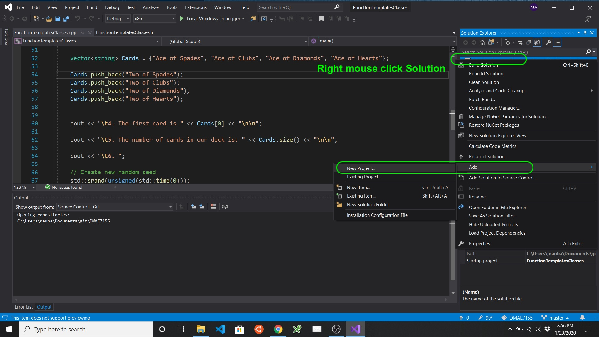
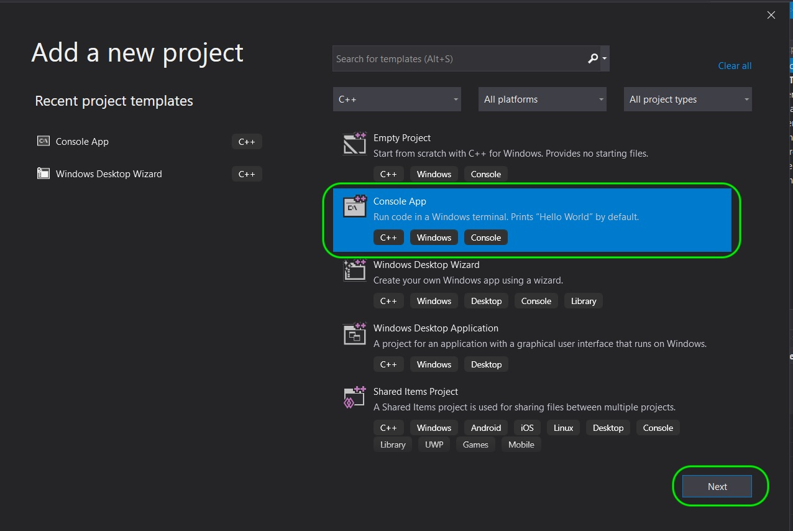
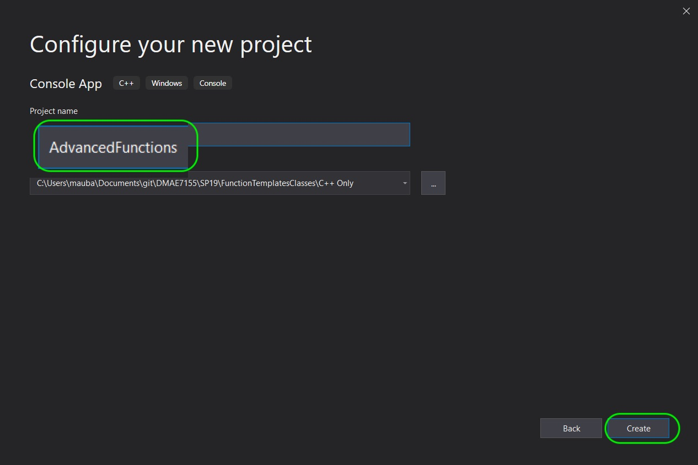
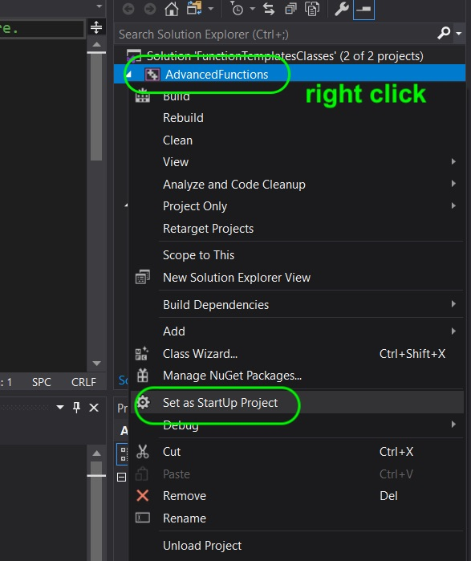
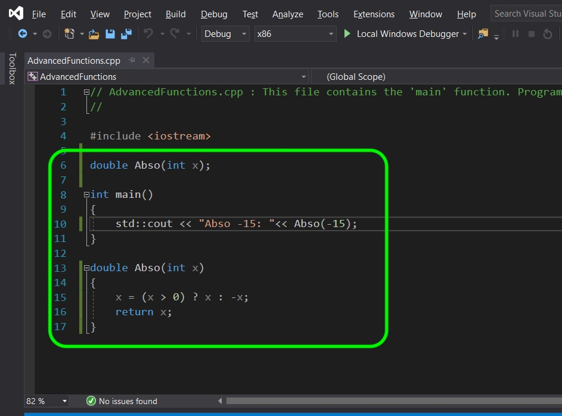
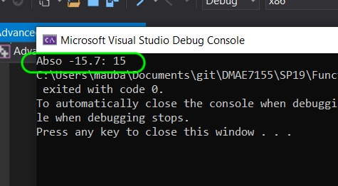
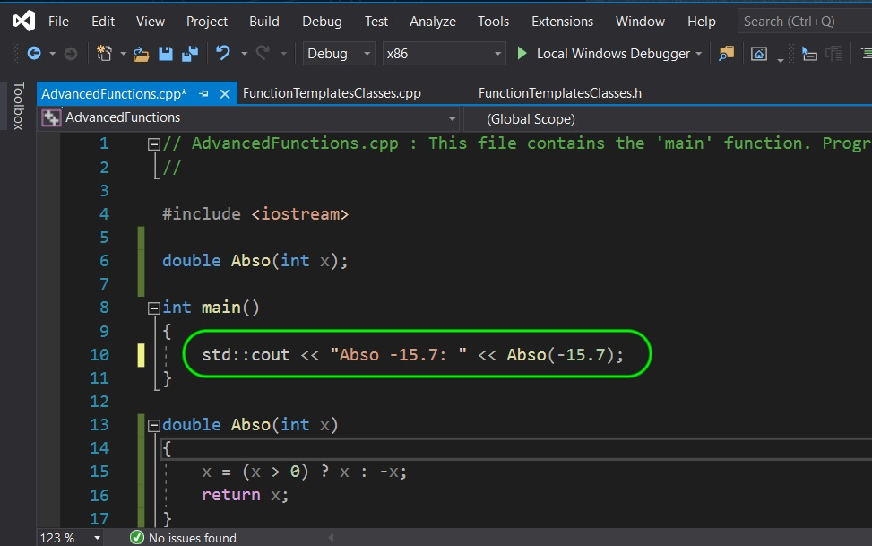
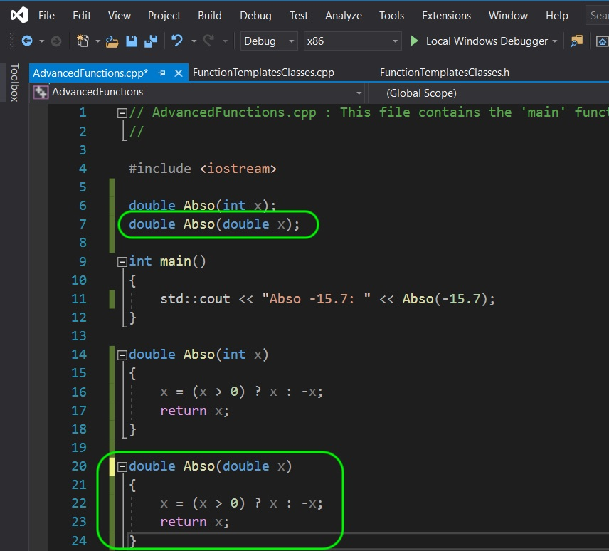
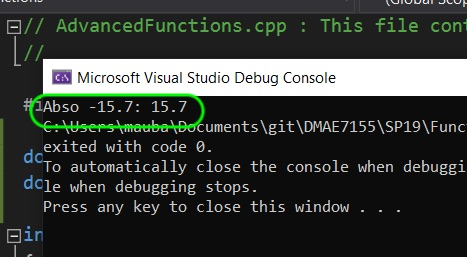

### Overloaded Function

[previous](../) • [home](../README.md#user-content-gms2-top-down-shooter) • [next](../)

Now in C++ we can overload functions.  What does this mean?  This means that we can use the same function return type and name with different parameters.  This allows you to call a function and pass it different parameters and get results that make sense to the caller.  Lets take a look.

 

---

##### `Step 1.`\|`SPCRK`|:small_blue_diamond:

Reopen the **FunctionTemplateClasses** solution.  Right click on the solution and select **Add \| New Project...**. 

##### `Step 2.`\|`FHIU`|:small_blue_diamond: :small_blue_diamond: 

Create a new **Console App** template then press the **Next** button. 

##### `Step 3.`\|`SPCRK`|:small_blue_diamond: :small_blue_diamond: :small_blue_diamond:

Call this new project `AdvancedFunctions` then press the **Create** button.

##### `Step 4.`\|`SPCRK`|:small_blue_diamond: :small_blue_diamond: :small_blue_diamond: :small_blue_diamond:

Right click on this new project and select **Set As StartUp Project**.

##### `Step 5.`\|`SPCRK`| :small_orange_diamond:

Now lets create a new function called `double Abso(int x)`.  This function will return a double and take as a parameter the **integer x**. This function will return the same number but remove the negative sign.  So a number of -10 will return 10 and a positive number will just return the same number.

##### `Step 6.`\|`SPCRK`| :small_orange_diamond: :small_blue_diamond:

Compile and run to see the negative number passed return in its absolute form:

##### `Step 7.`\|`SPCRK`| :small_orange_diamond: :small_blue_diamond: :small_blue_diamond:

So lets see why we would to have the function take different types.  What if we call the same name and pass it a **double** with a fractional value like so:

##### `Step 8.`\|`SPCRK`| :small_orange_diamond: :small_blue_diamond: :small_blue_diamond: :small_blue_diamond:

Now when you run it the value is cast to an integer when it gets sent to the function.  This is because the parameter passed is an integer so it gets converted when sent to the function. So we get an integer back even if the return type is double.  

##### `Step 9.`\|`SPCRK`| :small_orange_diamond: :small_blue_diamond: :small_blue_diamond: :small_blue_diamond: :small_blue_diamond:

Now we can only override a function with the same name if the return type is the same.  If we change the return type, we need to change the name. So lets override this function with a parameter of double.

##### `Step 10.`\|`SPCRK`| :large_blue_diamond:

Compile and run and you now get a double back that is not truncated.  This override works nicely as the caller doesn't have to worry about what type they send.  If they feel that it is negative number they will always get a double back with a value that makes sense.

| [previous](../)| [home](../README.md#user-content-gms2-top-down-shooter) | [next](../)|
|---|---|---|
