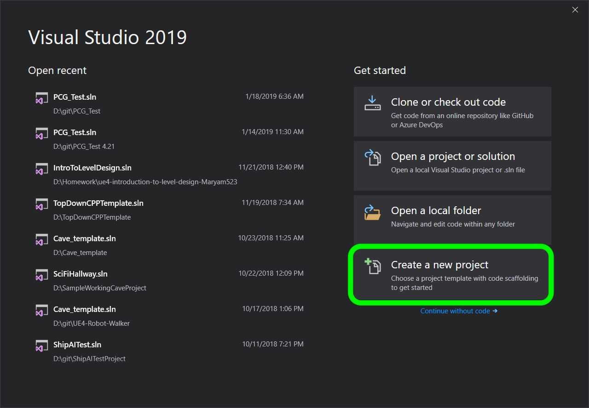
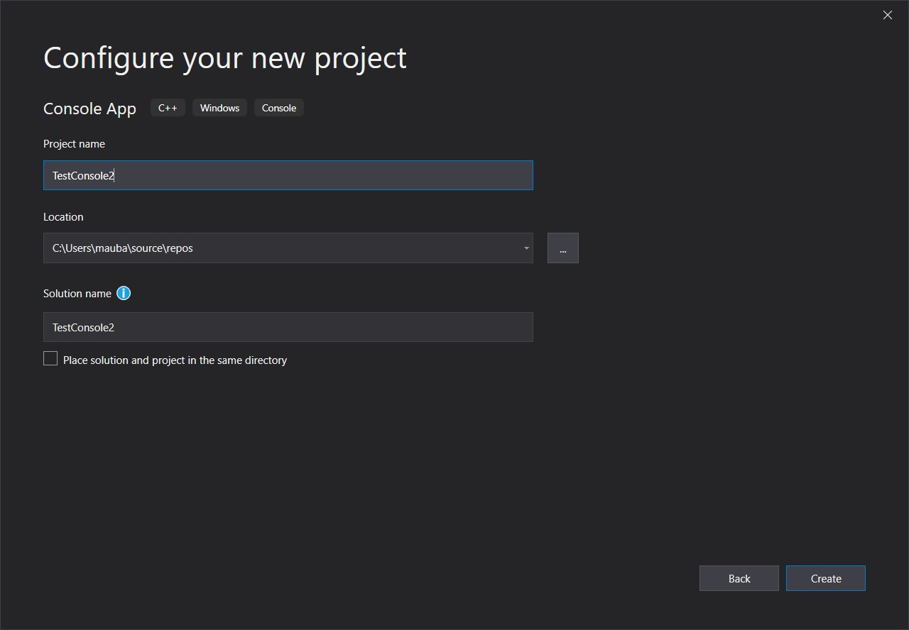

### Setting Up

[home](../README.md#user-content-gms2-top-down-shooter) • [next](../)

Lets look at how functions work in C++ and in Unreal Blueprints. Then lets create a function in C++ that works within blueprints.

There are user defined functions as well as supplied functions by the language we are using or a library we are including. It is a block of code that performs a task. We can pass it parameters (various variables)and the function can return a single type or none at all (void). Let's write a simple function:

 

---

##### `Step 1.`\|`SPCRK`|:small_blue_diamond:

Settig up Project for Simple Function in CPP.

 Open up [Visual Studio 19 Community](https://visualstudio.microsoft.com/downloads/) and you should be able to login with your LSU credentials. You should see a screen like this. Click on the **Create a New Project** button:

##### `Step 2.`\|`FHIU`|:small_blue_diamond: :small_blue_diamond: 

Select a **Console App** as we will only be working withing the console.

##### `Step 3.`\|`SPCRK`|:small_blue_diamond: :small_blue_diamond: :small_blue_diamond:

Name the solution `FunctionTemplatesClasses` and select a location on your hard drive to save it in.

| [home](../README.md#user-content-gms2-top-down-shooter) | [next](../)|
|---|---|
