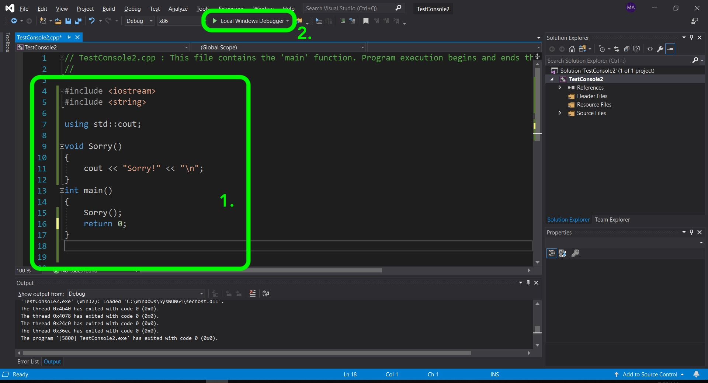
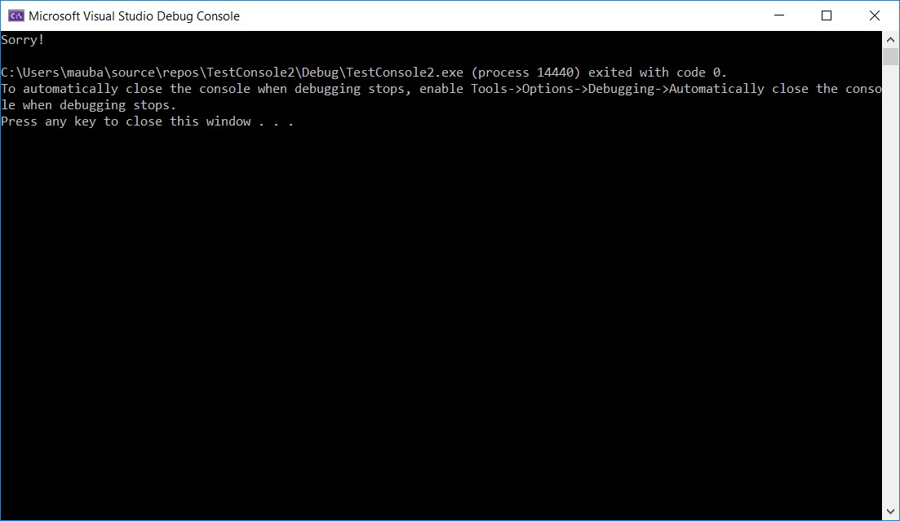
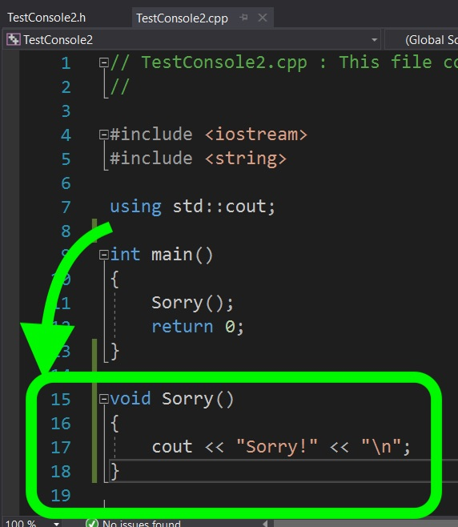
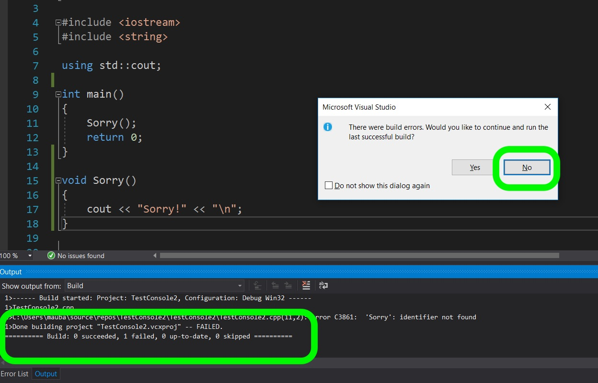
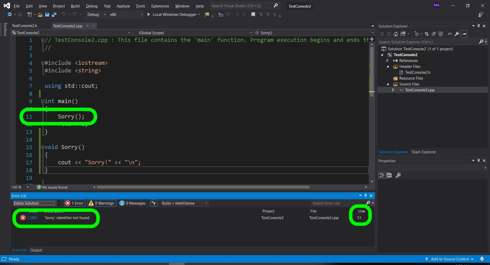

### Simple Function

[previous](../) • [home](../README.md#user-content-gms2-top-down-shooter) • [next](../)

Chapter introduction here.

 

---

##### `Step 1.`\|`SPCRK`|:small_blue_diamond:

A function has three components. We start with `ReturnType` then we have the name of the function `FunctionName` and then in parenthesis we can pass it parameters (or not) separated by commas like `(Param1, Param2)`. So for example we can have a function that just prints a message that returns no value nor does it take any parameters that can read `void Sorry()`. This is a function that returns nothing and takes no parameters. Let's give this a shot.

Lets now create a function. Now we have used functions before `main()` is a function that visual studio runs first by default. We can also define a new function. In this case we defined a new function that returns no value (it is void). Next run the game to see what happens.

##### `Step 2.`\|`FHIU`|:small_blue_diamond: :small_blue_diamond: 

 Run the game and `Main()` runs and calls the function. The function just prints **Sorry!** to the console.

##### `Step 3.`\|`SPCRK`|:small_blue_diamond: :small_blue_diamond: :small_blue_diamond:

Now what happens if the `Sorry()` function is placed AFTER the `Main()` function? Try it and press the **Run** button:

##### `Step 4.`\|`SPCRK`|:small_blue_diamond: :small_blue_diamond: :small_blue_diamond: :small_blue_diamond:

Now the build won't compile or run. If you look at the bottom you should see an **Output** tab that has 0 succeeded builds and 1 file that failed to compile. You get an error message asking if you want to run the previous build. Press the **No** button.

##### `Step 5.`\|`SPCRK`| :small_orange_diamond:

Now you can see in the bottom tab an error list where it can't find the identifier on line 11 in the FunctionTemplatesClasses.cpp file. The compiler does not kow that the function exists when it gets to it and we need to declare it first (even before it is defined).

##### `Step 6.`\|`SPCRK`| :small_orange_diamond: :small_blue_diamond:

##### `Step 7.`\|`SPCRK`| :small_orange_diamond: :small_blue_diamond: :small_blue_diamond:

##### `Step 8.`\|`SPCRK`| :small_orange_diamond: :small_blue_diamond: :small_blue_diamond: :small_blue_diamond:

##### `Step 9.`\|`SPCRK`| :small_orange_diamond: :small_blue_diamond: :small_blue_diamond: :small_blue_diamond: :small_blue_diamond:

##### `Step 10.`\|`SPCRK`| :large_blue_diamond:

##### `Step 11.`\|`SPCRK`| :large_blue_diamond: :small_blue_diamond: 

##### `Step 12.`\|`SPCRK`| :large_blue_diamond: :small_blue_diamond: :small_blue_diamond: 

##### `Step 13.`\|`SPCRK`| :large_blue_diamond: :small_blue_diamond: :small_blue_diamond:  :small_blue_diamond: 

##### `Step 14.`\|`SPCRK`| :large_blue_diamond: :small_blue_diamond: :small_blue_diamond: :small_blue_diamond:  :small_blue_diamond: 

##### `Step 15.`\|`SPCRK`| :large_blue_diamond: :small_orange_diamond: 

##### `Step 16.`\|`SPCRK`| :large_blue_diamond: :small_orange_diamond:   :small_blue_diamond: 

##### `Step 17.`\|`SPCRK`| :large_blue_diamond: :small_orange_diamond: :small_blue_diamond: :small_blue_diamond:

##### `Step 18.`\|`SPCRK`| :large_blue_diamond: :small_orange_diamond: :small_blue_diamond: :small_blue_diamond: :small_blue_diamond:

##### `Step 19.`\|`SPCRK`| :large_blue_diamond: :small_orange_diamond: :small_blue_diamond: :small_blue_diamond: :small_blue_diamond: :small_blue_diamond:

##### `Step 20.`\|`SPCRK`| :large_blue_diamond: :large_blue_diamond:

##### `Step 21.`\|`SPCRK`| :large_blue_diamond: :large_blue_diamond: :small_blue_diamond:

___

| [previous](../)| [home](../README.md#user-content-gms2-top-down-shooter) | [next](../)|
|---|---|---|
