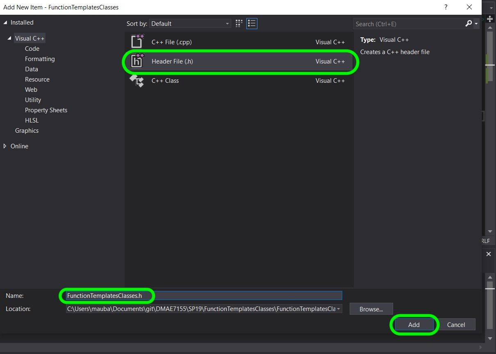
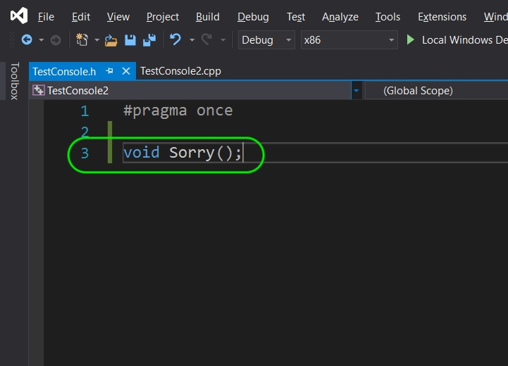
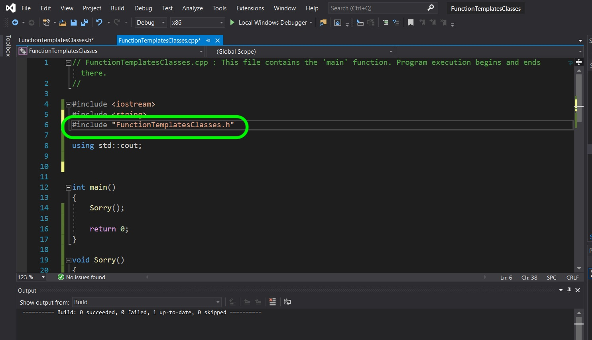

### Simple Function

[previous](../) • [home](../README.md#user-content-gms2-top-down-shooter) • [next](../)

Chapter introduction here.

 

---

##### `Step 1.`\|`SPCRK`|:small_blue_diamond:

A function has three components. We start with `ReturnType` then we have the name of the function `FunctionName` and then in parenthesis we can pass it parameters (or not) separated by commas like `(Param1, Param2)`. So for example we can have a function that just prints a message that returns no value nor does it take any parameters that can read `void Sorry()`. This is a function that returns nothing and takes no parameters. Let's give this a shot.

Lets now create a function. Now we have used functions before `main()` is a function that visual studio runs first by default. We can also define a new function. In this case we defined a new function that returns no value (it is void). Next run the game to see what happens.

##### `Step 2.`\|`FHIU`|:small_blue_diamond: :small_blue_diamond: 

 Run the game and `Main()` runs and calls the function. The function just prints **Sorry!** to the console.

##### `Step 3.`\|`SPCRK`|:small_blue_diamond: :small_blue_diamond: :small_blue_diamond:

Now what happens if the `Sorry()` function is placed AFTER the `Main()` function? Try it and press the **Run** button:

##### `Step 4.`\|`SPCRK`|:small_blue_diamond: :small_blue_diamond: :small_blue_diamond: :small_blue_diamond:

Now the build won't compile or run. If you look at the bottom you should see an **Output** tab that has 0 succeeded builds and 1 file that failed to compile. You get an error message asking if you want to run the previous build. Press the **No** button.

##### `Step 5.`\|`SPCRK`| :small_orange_diamond:

Now you can see in the bottom tab an error list where it can't find the identifier on line 11 in the FunctionTemplatesClasses.cpp file. The compiler does not kow that the function exists when it gets to it and we need to declare it first (even before it is defined).

##### `Step 6.`\|`SPCRK`| :small_orange_diamond: :small_blue_diamond:

What we can do is tell the compiler before the function definition that there is a declaration (stating the the definition is somewhere in the file). As long as the declaration is before the definition, it will compile and run as before. In the above case it would look like:

##### `Step 7.`\|`SPCRK`| :small_orange_diamond: :small_blue_diamond: :small_blue_diamond:

It is good practice to build before you run, if you can. You can do this by selecting **Build \| Build NAMEOFPROJECT** or by pressing **control b** on the keyboard. You will notice that it now builds and runs as it did previously. Check this on your end.

##### `Step 8.`\|`SPCRK`| :small_orange_diamond: :small_blue_diamond: :small_blue_diamond: :small_blue_diamond:

Notice that our program is located in a `.cpp` file called **FunctionTemplatesClasses.cpp**. This is usually where we keep our definitions. Our declarations are usually held in a `.h` file. Lets move this to a `.h` file. Right click on the **Solution Explorer \| HeaderFiles** folder and select **Add \| New Item**:

##### `Step 9.`\|`SPCRK`| :small_orange_diamond: :small_blue_diamond: :small_blue_diamond: :small_blue_diamond: :small_blue_diamond:

Select the file type **Header File (.h)** and it is customary to name the file that holds the declarations with the same name as the one with the definitions. So I called it `FunctionTemplatesClasses.h` then pressed the **Add** button:

##### `Step 10.`\|`SPCRK`| :large_blue_diamond:

Now remove the declaration from the `.cpp` file and add it under the provide line `#pragma once`. What does [#pragma once](https://en.wikipedia.org/wiki/Pragma_once) do? It is a non-standard but widely supported preprocessor directive that tells the compiler to only include this file in the final program once. Now a game can be made up of hundreds if not thousands of files, and a header file could be used in many places. This ensures that no many how many times it is used it is just included one time in the final program.

##### `Step 11.`\|`SPCRK`| :large_blue_diamond: :small_blue_diamond: 

Now if we try and run it, this will not work. The `.cpp` file does not know to look for this declaration. So go back to the *cpp* file and add an `#include` with the `"FunctionTemplatesClasses.h` file like so:

##### `Step 12.`\|`SPCRK`| :large_blue_diamond: :small_blue_diamond: :small_blue_diamond: 

Next, run the game again it should find the definition by including the `.h` file. Looks no different than before.

##### `Step 13.`\|`SPCRK`| :large_blue_diamond: :small_blue_diamond: :small_blue_diamond:  :small_blue_diamond: 

| [previous](../)| [home](../README.md#user-content-gms2-top-down-shooter) | [next](../)|
|---|---|---|
