### Static Arrays

[previous](../) • [home](../README.md#user-content-gms2-top-down-shooter) • [next](../)

Lets quickly look at static arrays in C++. A static array size is fixed and decided at compile time. Please note that we cannot use static arrays within blueprints. We will get to a dynamic array container that comes with Unreal next.

"A static array is a pre-defined series of elements of the same type placed in contiguous memory locations that can be individually referenced by adding an index to a unique identifier." - cplusplus.com

 

---

##### `Step 1.`\|`SPCRK`|:small_blue_diamond:

Create a new C++ class and make it inherit from the **Actor** class. Call it `ArrayCounterActor`. We add a new static array and need to give it a type and a number elements it will contain. This is not dynamic we need to determine the size of the array at compile time. Go to the `.h` file and create an array called `Cards` that contains the face value of 4 playing cards `Cards[4]`. An array keeps a list of items of the same type of **FText**.

We also need a TextRender component to demonstrate our working array.

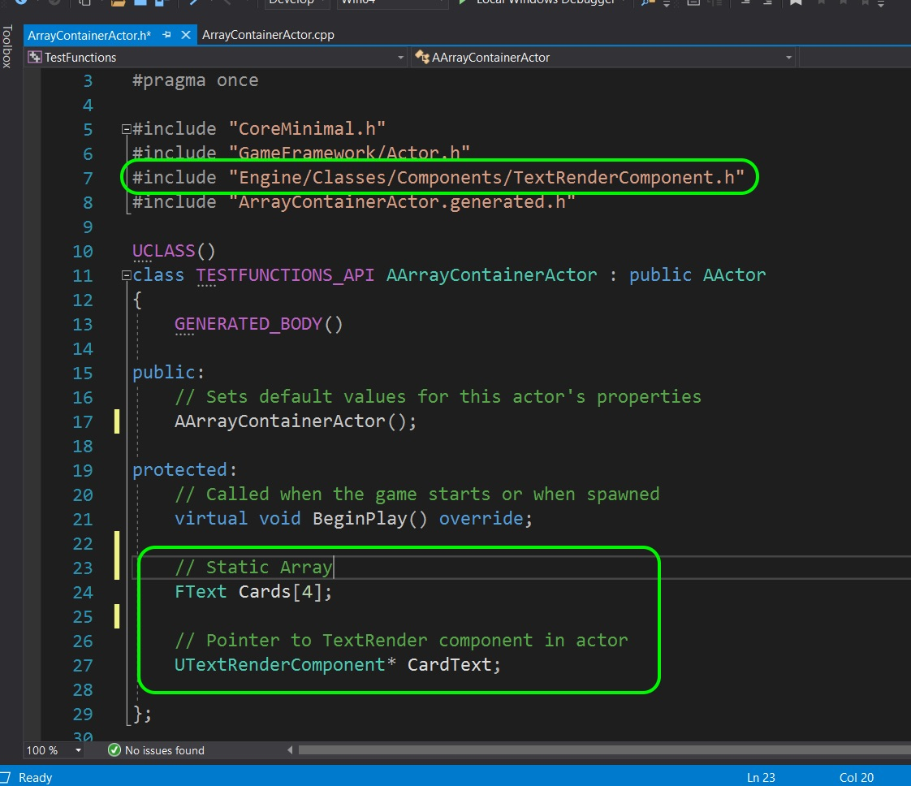

##### `Step 2.`\|`FHIU`|:small_blue_diamond: :small_blue_diamond: 

Open up the `.cpp` file and instantiate the text renderer component and create an array with the text of the four ace playing cards. Then we will set the array to the first entry and change the color to green. Notice that our first array item **ALWAYS** starts with `0`.

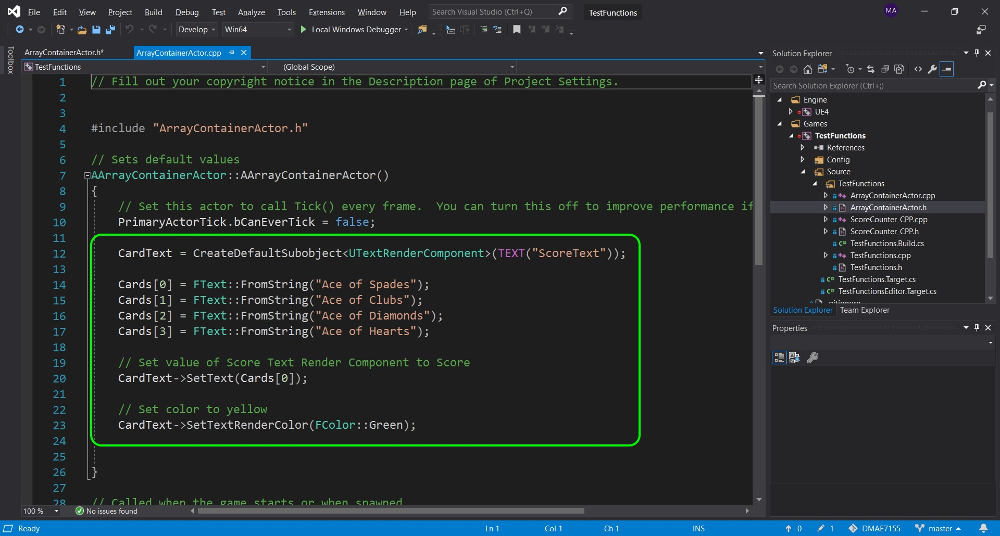

##### `Step 3.`\|`SPCRK`|:small_blue_diamond: :small_blue_diamond: :small_blue_diamond:

Now go back to the editor and create a new level called `ArraysVectorLevel` based on the default template. Add an instance into the level of `ArrayContainerActor`. Notice that all our work is in the constructor so we immediately see it pick our first entry **Ace of Spades**.

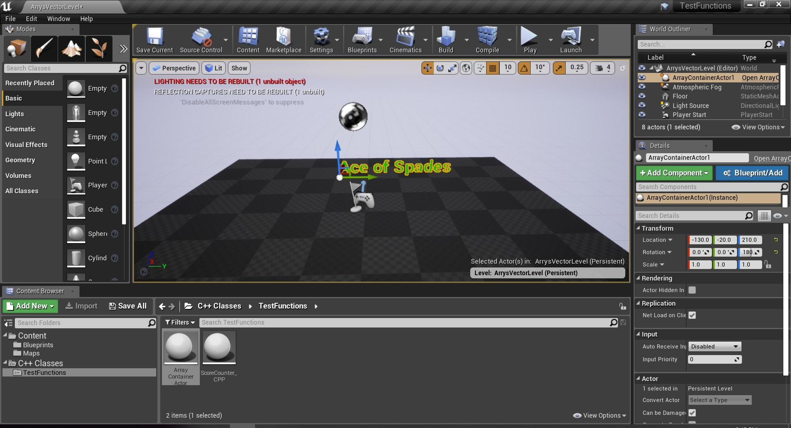

##### `Step 4.`\|`SPCRK`|:small_blue_diamond: :small_blue_diamond: :small_blue_diamond: :small_blue_diamond:

So Blueprints don't support static arrays, but lets see what happens if we add a `UPROPERTY` and expose it to blueprints.

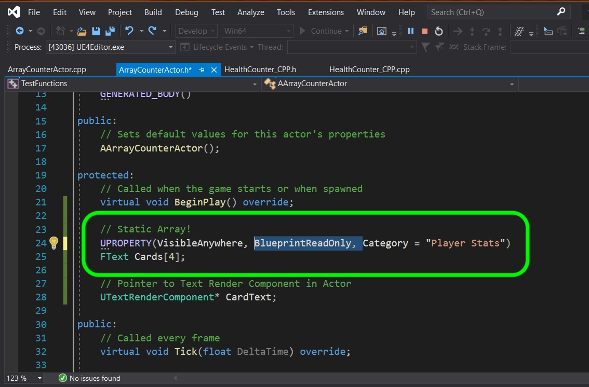

##### `Step 5.`\|`SPCRK`| :small_orange_diamond:

Press compile and see if it works?

It is best to compile in the Unreal engine as you will get better error messages. Unreal states that you can't expose an array to Blueprints.

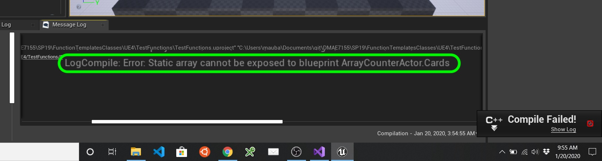

##### `Step 6.`\|`SPCRK`| :small_orange_diamond: :small_blue_diamond:

We can still expose it to the editor and edit the values. Set the **UPPROPERTY** to **EditAnywhere**.

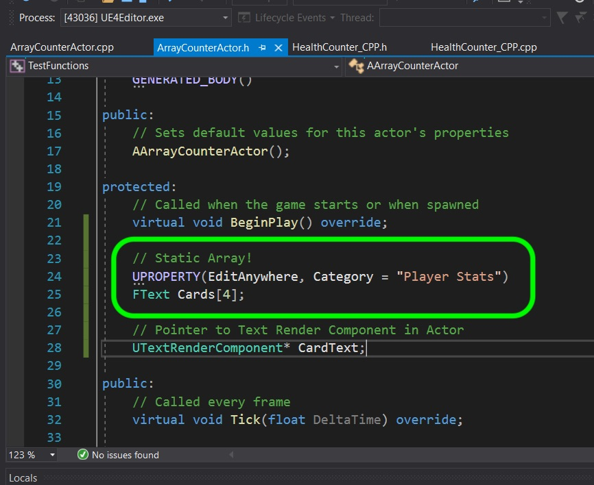

##### `Step 7.`\|`SPCRK`| :small_orange_diamond: :small_blue_diamond: :small_blue_diamond:

Now compile in the game engine and select the game item in the **World Outliner**. Then look at the variables and you can still edit the content of the **Cards** aray.

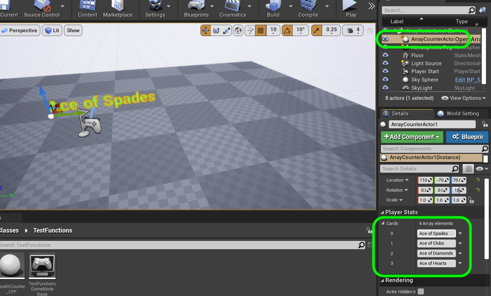

##### `Step 8.`\|`SPCRK`| :small_orange_diamond: :small_blue_diamond: :small_blue_diamond: :small_blue_diamond:

Now we can work around this by creating an integer that we CAN edit in Unreal and use this to access the card index. Open up the `.h` and add a variable called `CardIndex` and give it a valid UPROPERTY and make it editable and read writable.

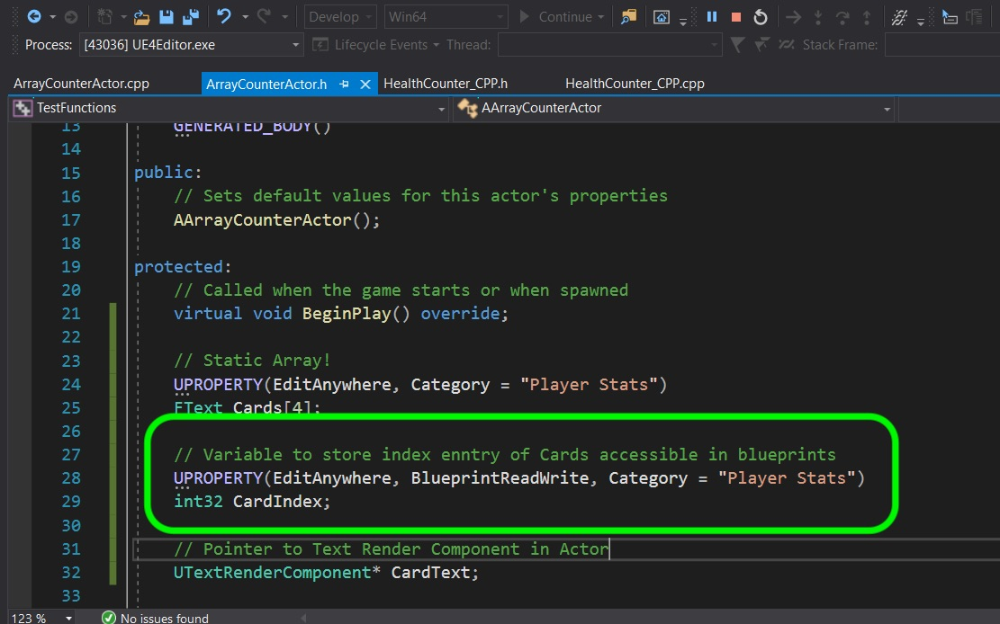

##### `Step 9.`\|`SPCRK`| :small_orange_diamond: :small_blue_diamond: :small_blue_diamond: :small_blue_diamond: :small_blue_diamond:

Open up **ArrayContainerActor.cpp** and in the **BeginPlay** event change the card to a selected index based on this new variable we just created. Also, reset teh **CardText** to this potentially new value.

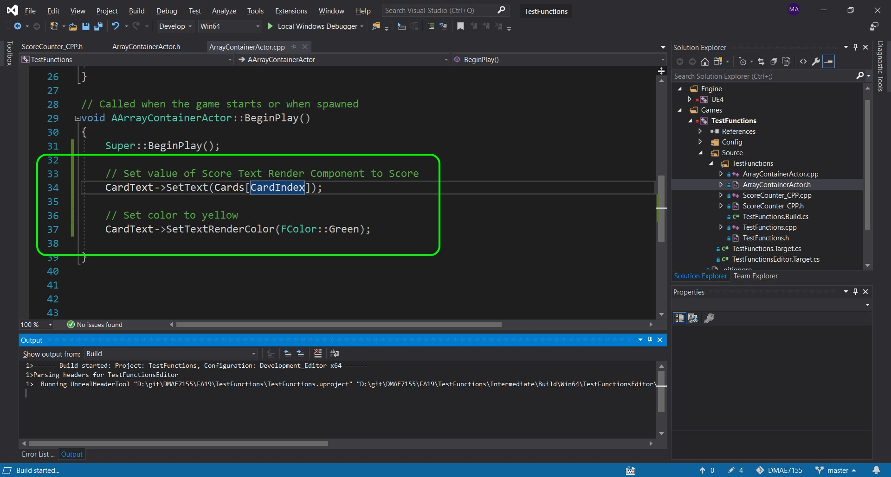

##### `Step 10.`\|`SPCRK`| :large_blue_diamond:

Quit Unreal as we want to run the game from Visual Studio. We are going to force a hard crash on purpose. If we run it from VS then we will get added error information, if we run it just by launching it normally it will just shut down and we will get no information about why the game crashes.

Press the green triangle called **Local Windows Debugger** and it will launch Unreal.and position the new C++ actor in front of where the player spawns. Now you can run a different card each time by changing the value in the **World Outliner** by changing the value of **Card Index**. Now what happens if you try and access an array item that is outside of the memory we allocated (say the 5th non existant array).

##### `Step 11.`\|`SPCRK`| :large_blue_diamond: :small_blue_diamond: 

 So it crashes to Visual Studio. We get an error saying that we have anb access violation. We will explore the debugger more in the future.

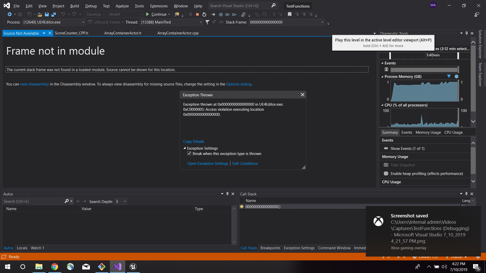

##### `Step 12.`\|`SPCRK`| :large_blue_diamond: :small_blue_diamond: :small_blue_diamond: 

Now we want non-programmers to use the game engine and tune variables we expose to them. There is a way to prevent an accidental crash. In the UPROPERTY we can restrict the minimum and maximum range the user can enter in the game engine. This will stop them from setting a number that goes out of range. We need to clamp both a value the player enters with the keyboard as well as one that they enter when using the slider. We use this meta command to retrict both. `UIMin` and `UIMax` restict the slider and `ClampMin` and `ClampMax` clamps any value entered with the keyboard.

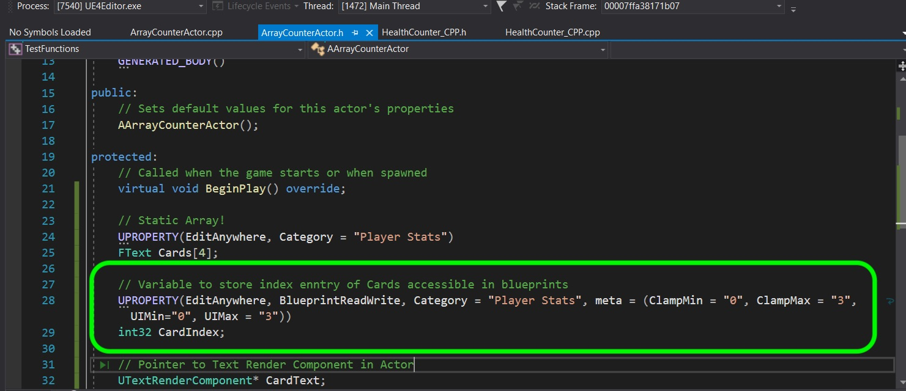

##### `Step 13.`\|`SPCRK`| :large_blue_diamond: :small_blue_diamond: :small_blue_diamond:  :small_blue_diamond: 

Again, run the game from **Visual Studio** and try dragging the value with the mouse and using the slider as well as entering an invalid number. Notice how we have solved this potential problem! Remember that we want to minimize the chances of crashes that slows the entire team down. If there is a range that should be applied setting it for the editor is a good way to proceed.

___

| [previous](../)| [home](../README.md#user-content-gms2-top-down-shooter) | [next](../)|
|---|---|---|
