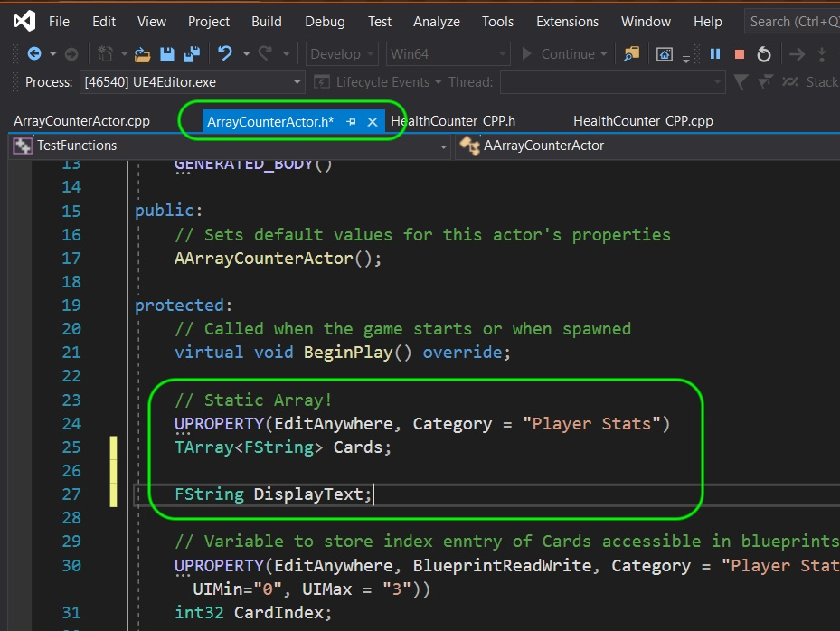
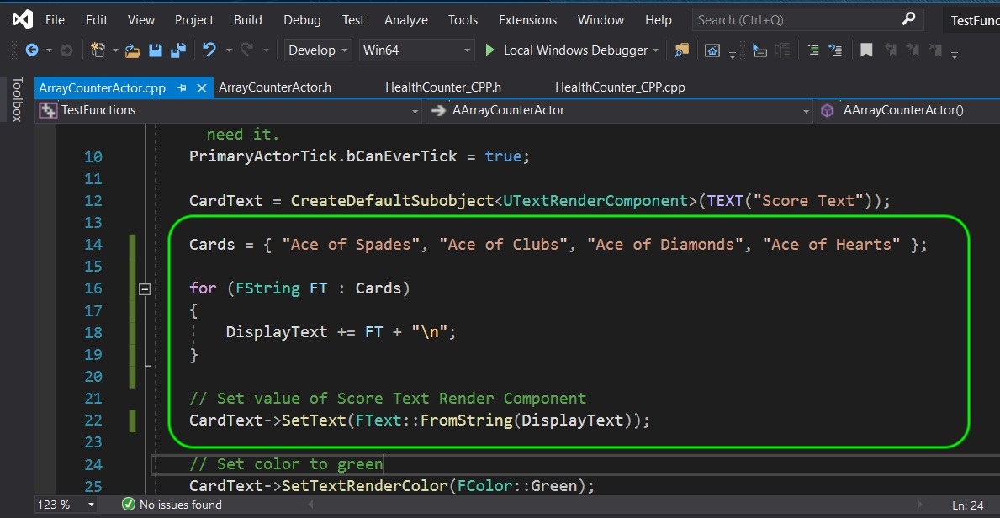
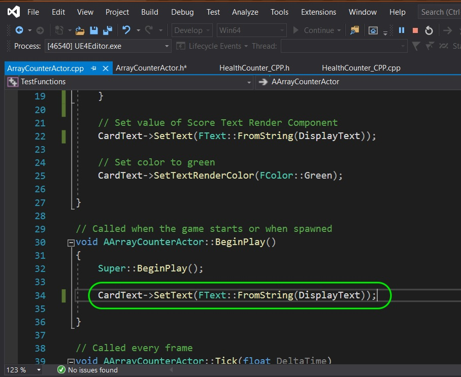
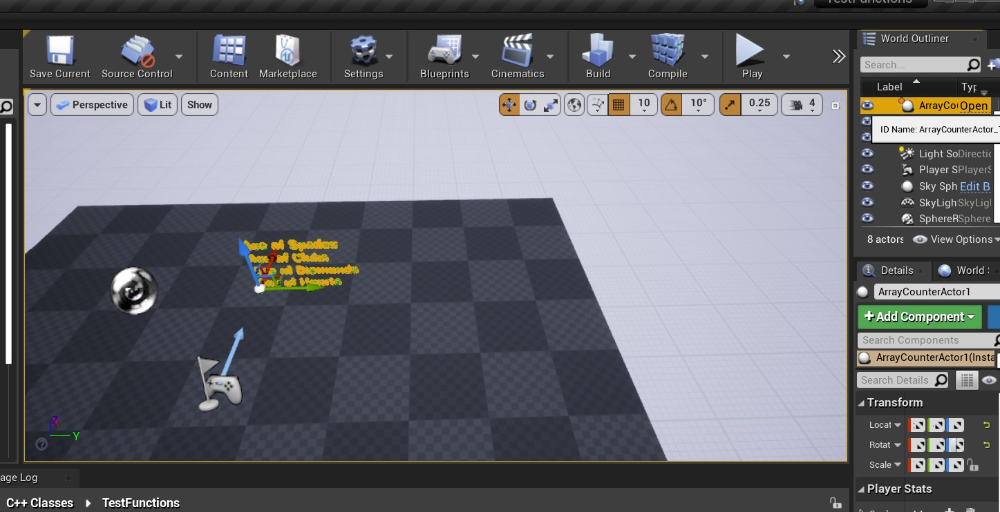
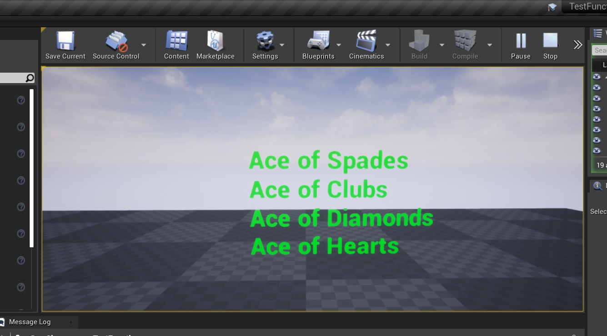
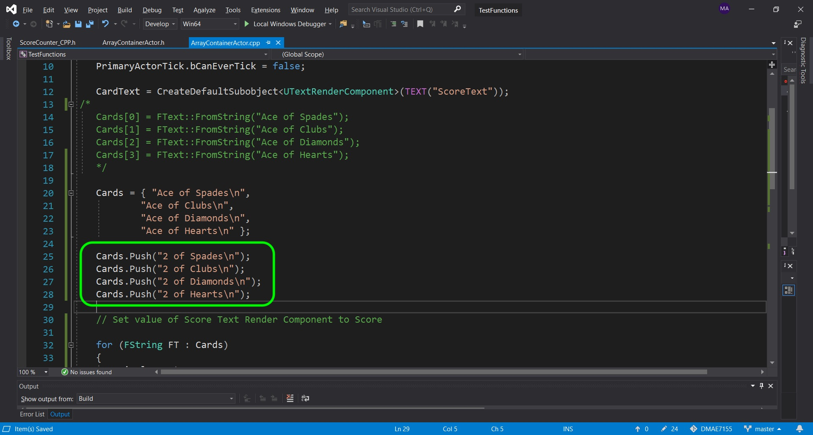
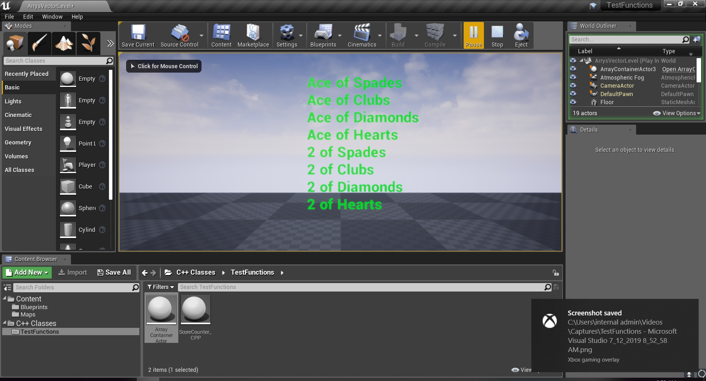

### TArray

[previous](../) • [home](../README.md#user-content-gms2-top-down-shooter) • [next](../)

Since the standard template functions are not optimized to run at maximum efficiency in run-time systems Unreal has written their own  **std::vector** counterpart.  It is of type `TArray` (T stands for template).  This is a dynamic array created for a run-time system. This allows you to add elements at run-time. There are other game ready implementations you could use including [EA STL](https://github.com/electronicarts/EASTL/tree/master/include/EASTL).

 

---

##### `Step 1.`\|`SPCRK`|:small_blue_diamond:

Open up **TestFunctions.uproj** and go to the **ArrayVectorLevel**.  Open up **ArrayCounterActor.h** and change the **Cards** type to a TArray with **FString** type in the template. Lets also add another **FString** called `DisplayText` to concatonate the various cards.

##### `Step 2.`\|`FHIU`|:small_blue_diamond: :small_blue_diamond: 

Open the `.cpp` file and change the assignment of cards to a single statement.  Then use a for each loop and concatonate the various cards. Then we display this new concatonated text string by setting the text in the constructor.

##### `Step 3.`\|`SPCRK`|:small_blue_diamond: :small_blue_diamond: :small_blue_diamond:

Now go to **BeginPlay** and update the variable we set the text to where we change a **String** to a **Text** format.

##### `Step 4.`\|`SPCRK`|:small_blue_diamond: :small_blue_diamond: :small_blue_diamond: :small_blue_diamond:

Now launch the editor from the compiler again (close it if it is currently running).  Go into the game and see if the constructor is showing all 4 cards. If it is showing the previous version you can delete the actor in the scene and drag a new one in the scene. 

##### `Step 5.`\|`SPCRK`| :small_orange_diamond:

 Now run the game and you will see it change colors when running the **BeginPlay** function:

##### `Step 6.`\|`SPCRK`| :small_orange_diamond: :small_blue_diamond:

Since this is a dynamic array we can make changes to the size of the **TArray**.  We do this by pushing new elements to the end of the array. Use the function in the **TArray** template called `Push()` and pass it another set of cards like so:

##### `Step 7.`\|`SPCRK`| :small_orange_diamond: :small_blue_diamond: :small_blue_diamond:

Now save your work, go to the game and press the compile button (you can't compile in Visual Studio if you are running the game from it).  This will compile the C++ code if you saved it! Move the object in the scene to kick the constructor to re-run. Now you should see 8 items like so when run:

| [previous](../)| [home](../README.md#user-content-gms2-top-down-shooter) | [next](../)|
|---|---|---|
